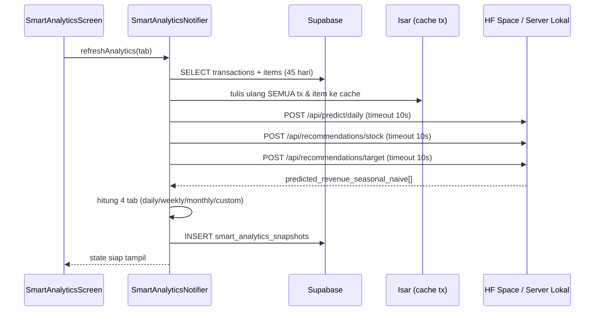
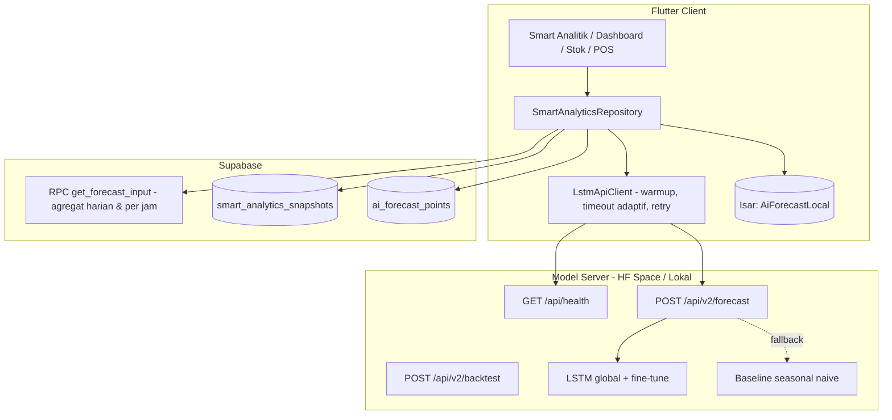

# Rencana Peningkatan & Perluasan Model LSTM — Parzello POS

> **Tanggal**: 28 Juli 2026
> **Ruang lingkup**: `lib/features/reports/` (Smart Analitik), server model prediksi, dan penerapan hasil prediksi ke fitur lain (Dashboard, Stok, Produk, POS, Laporan, Notifikasi, Voucher).
> **Status**: Sebagian besar sudah diterapkan — lihat §0.

---

## 0. Status Implementasi

| Milestone | Status | Catatan |
| :--- | :---: | :--- |
| **M1** Fondasi & kejujuran data | ✅ Selesai | Refactor 4 lapisan, T-02/T-03/T-09/T-11/T-14/T-16 diperbaiki, 55 unit test |
| **M2** Pipa data & cache | ✅ Selesai | Migrasi `20260728_lstm_forecast.sql` **sudah dijalankan** ke project `nolawradcdkemdyumoqs` (28 Jul 2026, versi `lstm_forecast_v2`) dan diverifikasi fungsional. Cache offline memakai JSON `SharedPreferences` (mitigasi §13, bukan koleksi Isar) |
| **M3** Model LSTM v2 | ⚠️ Sisi klien selesai, server belum | `LstmApiClient` sudah bicara v2 + fallback otomatis ke v1. Training & endpoint Python berada di repo terpisah |
| **M4** Penerapan ke fitur | ✅ Selesai (8/8) | Smart Analitik, Dashboard, Stok, Katalog Produk, Performa & POS, Notifikasi, Smart Pricing→voucher, Pengaturan Toko |
| **M5** Evaluasi & transparansi | ✅ Selesai | Layar `/smart-analytics/accuracy`, ekspor CSV, label mode §10 |
| **M6** Opsional | ⛔ Belum | Cuaca & fine-tune per toko — menunggu hasil backtest M3 |

**Yang masih memblokir klaim "LSTM" di skripsi**: M3 sisi server. Sampai `/api/v2/forecast` mengembalikan `model_used: "lstm"`, aplikasi akan menampilkan label "Estimasi statistik (pola mingguan)" — sesuai aturan §10, dan itu memang keadaan yang sebenarnya.

---

## 1. Ringkasan Eksekutif

Fitur "Smart Analitik (LSTM)" saat ini **sudah berjalan end-to-end** (UI → HTTP → snapshot Supabase → riwayat), tetapi hasil audit kode menunjukkan tiga masalah besar:

1. **Yang dipakai bukan LSTM.** Aplikasi membaca field `predicted_revenue_seasonal_naive` dari server (`smart_analytics_provider.dart:1253`), yaitu baseline *seasonal naive* — bukan keluaran jaringan LSTM. Label "Prediksi AI"/"proyeksi cerdas LSTM" di UI tidak sesuai dengan model yang benar-benar menghasilkan angka.
2. **Tidak ada bukti akurasi.** Tidak ada satu pun metrik (MAE/RMSE/MAPE), dan tidak ada penyimpanan prediksi per tanggal untuk dibandingkan dengan realisasi. Untuk skripsi, ini bagian yang paling krusial dan saat ini kosong.
3. **LSTM hanya "mendarat" di satu layar.** Hasil prediksi berhenti di `/smart-analytics`. Dashboard, Manajemen Stok, Produk, POS, Laporan, dan Notifikasi sama sekali tidak memanfaatkannya, padahal di sanalah nilai bisnisnya paling terasa.

Dokumen ini memuat: audit kondisi saat ini (§2), arsitektur & kontrak API target (§4–5), perubahan skema data (§6), refactor kode Flutter (§7), **peta penerapan LSTM ke 9 fitur** (§8), strategi model & evaluasi untuk skripsi (§9), lalu milestone, pengujian, dan risiko (§11–14).

---

## 2. Audit Kondisi Saat Ini

### 2.1 Alur yang berjalan sekarang



### 2.2 Temuan

| # | Temuan | Lokasi | Dampak |
| :--- | :--- | :--- | :--- |
| **T-01** | Angka prediksi berasal dari `predicted_revenue_seasonal_naive`, bukan LSTM. `model_used` hanya disalin apa adanya dari metadata server. | `smart_analytics_provider.dart:1253`, `:1341` | **Kritis** — klaim "LSTM" di PRD & UI tidak terbukti. |
| **T-02** | Fallback lokal `predictForDay()` memakai `math.Random(date.day)` sebagai "variansi deep learning". | `smart_analytics_provider.dart:1012-1032` | **Kritis** — angka acak ditampilkan sebagai prediksi AI. |
| **T-03** | Hari tanpa transaksi diisi `getForecastValue(date) * 0.9` lalu digambar sebagai garis **"Riil"** (hijau solid). | `smart_analytics_provider.dart:557`, `:613`, `:682`, `:734` | **Kritis** — data historis difabrikasi; grafik menyesatkan dan membuat backtest mustahil. |
| **T-04** | Jendela data hanya **45 hari**. | `smart_analytics_provider.dart:812` | LSTM butuh ≥ 90–180 hari untuk menangkap musiman mingguan + bulanan. |
| **T-05** | Tidak ada metrik akurasi & tidak ada penyimpanan prediksi per tanggal. | — | Tidak bisa mengisi Bab 4 skripsi (evaluasi model). |
| **T-06** | Snapshot hanya dibaca dari Supabase; offline → layar kosong. | `smart_analytics_provider.dart:447-476` | Melanggar prinsip offline-first aplikasi. |
| **T-07** | 3 panggilan HTTP sekuensial @10 detik; HF Space *cold start* umumnya > 10 detik. | `:1173`, `:1207`, `:1223` | Sering diam-diam jatuh ke fallback lokal (T-02). |
| **T-08** | `refreshAnalytics` menarik seluruh baris transaksi + item 45 hari lalu **menulis ulang semuanya ke Isar** setiap refresh. | `:823-881` | Boros kuota & I/O; tidak sejalan dengan pola RPC agregat yang sudah dipakai `get_analytics` / `get_sales_performance`. |
| **T-09** | Label bulan meleset satu langkah: array diawali `'Des'`, indeks `(month-1)%12` → Januari terbaca "Des", Juli terbaca "Jun". | `:654-667`, `:685`, `:700` | Bug tampilan pada tab Bulanan. |
| **T-10** | Total "bulan depan" menjumlahkan H+1…H+n (mulai besok), bukan tanggal-tanggal bulan berikutnya. | `:695-699` | Angka tab Bulanan tidak sesuai definisinya. |
| **T-11** | Pembagian `slope / avgDailySales` & `forecast / avgDailySales` tanpa penjagaan nol. | `:590`, `:598-601` | Potensi `NaN`/`Infinity` tampil di KPI. |
| **T-12** | Tombol **"Terapkan"** pada kartu rekomendasi hanya memunculkan snackbar. | `smart_analytics_screen.dart:1281-1288` | Fitur *actionable* yang dijanjikan PRD belum ada. |
| **T-13** | `settings.operational.open_on_weekends` & `closed_months` dibaca provider, tapi **tidak pernah ditulis UI mana pun** (saat toko dibuat hanya `business_model`). | `store_provider.dart:118-120` vs `smart_analytics_provider.dart:796-798` | Parameter model selalu memakai default; profil toko tak pernah benar-benar dipakai. |
| **T-14** | Satu file 1.421 baris mencampur HTTP, agregasi, kalkulasi chart, persistensi, dan gaya UI (`Color`/`IconData` di provider). | `smart_analytics_provider.dart` | Sulit diuji unit; menghambat semua perbaikan di atas. |
| **T-15** | Janji PRD yang belum ada wujudnya: prediksi traffic per jam, integrasi cuaca, *confidence score*, kalender libur. | `Dokumen/PRD.md:293-302` | Kesenjangan dokumen vs implementasi. |
| **T-16** | `CLAUDE.md` masih menyatakan `/smart-analytics` khusus `owner`; router nyatanya hanya membatasi `/staff-management` & `/store-info`. | `router.dart:122-131` | Dokumen internal usang (perlu koreksi ringan). |

### 2.3 Janji PRD vs realita

| Kemampuan (PRD §5.5) | Status | Rencana |
| :--- | :---: | :--- |
| Sales forecasting harian/mingguan/bulanan | ⚠️ Ada, tapi baseline non-LSTM | §9 (model), §8.1 |
| Traffic prediction per jam | ❌ Belum ada (hanya rasio kasar) | §8.5 |
| Smart pricing (aksi nyata) | ⚠️ Kartu tampil, aksi no-op | §8.8 |
| Best-seller prediction + confidence | ⚠️ Ada, tanpa confidence | §8.4 |
| Integrasi cuaca | ❌ Belum ada | §9.4 (opsional, fase akhir) |
| Riwayat analitik | ✅ Berjalan | dipertahankan |

---

## 3. Sasaran & Batasan

**Sasaran**
- **S1** — Angka yang dilabeli "LSTM" benar-benar keluar dari model LSTM; semua mode lain diberi label jujur.
- **S2** — Setiap prediksi tersimpan per tanggal sehingga akurasi (MAE/RMSE/MAPE) dapat dihitung otomatis dan ditampilkan.
- **S3** — Hasil prediksi dipakai minimal di **5 fitur** di luar layar Smart Analitik.
- **S4** — Layar Smart Analitik tetap berguna saat offline (cache Isar), dengan penanda mode yang jelas.
- **S5** — Tidak ada lagi data historis yang difabrikasi di grafik.

**Non-sasaran (fase ini)**
- Training LSTM di perangkat (on-device).
- Rekomendasi harga berbasis elastisitas ekonomi penuh — cukup aturan margin + prediksi permintaan.
- Prediksi per-pelanggan (churn/CLV) di modul `customer`.

**Prinsip**
- Server model tetap **stateless per request** (riwayat dikirim di payload) agar tidak perlu menyimpan data toko di luar Supabase — sejalan dengan kebijakan PII di PRD §6.
- Kalau model tidak tersedia, **turunkan klaim, jangan turunkan kejujuran**: tampilkan "Estimasi statistik (mode offline)", bukan "Prediksi AI".

---

## 4. Arsitektur Target



Perubahan inti dibanding sekarang:
1. **Input model diambil lewat RPC agregat**, bukan menarik ribuan baris transaksi ke perangkat (memperbaiki T-04 & T-08 sekaligus: jendela bisa 180 hari dengan payload beberapa KB).
2. **Satu endpoint batch `/api/v2/forecast`** menggantikan 3 panggilan berurutan (T-07).
3. **`ai_forecast_points`** menyimpan tiap titik prediksi → dasar evaluasi akurasi (T-05).
4. **Cache Isar** untuk snapshot terakhir (T-06).

---

## 5. Kontrak API Model v2

Endpoint lama (`/api/predict/daily`, `/api/recommendations/*`) tetap dipertahankan satu rilis untuk kompatibilitas mundur, lalu dihapus.

### 5.1 `GET /api/health` — warmup

```json
{ "status": "ok", "model_loaded": true, "model_version": "lstm-v2.1.0", "warm": true }
```

Dipanggil klien **sebelum** request berat agar HF Space bangun; timeout pendek (3 detik). Hasilnya menentukan timeout request utama: `warm: true` → 15 detik, `warm: false` → 60 detik.

### 5.2 `POST /api/v2/forecast`

Request:

```json
{
  "store_profile": {
    "business_type": "Cafe",
    "open_on_weekends": true,
    "closed_months": [],
    "open_hour": 8,
    "close_hour": 21
  },
  "history": {
    "daily":  [{ "date": "2026-01-01", "revenue": 1250000, "tx_count": 34, "item_count": 71 }],
    "hourly": [{ "date": "2026-01-01", "hour": 12, "revenue": 240000, "tx_count": 8 }],
    "products": [{ "date": "2026-01-01", "product_id": "…", "qty": 12 }]
  },
  "horizon": { "daily": 30, "hourly": 24 },
  "targets": ["revenue", "traffic", "hourly_traffic", "product_demand"],
  "model": "auto"
}
```

Response:

```json
{
  "metadata": {
    "model_used": "lstm",
    "model_version": "lstm-v2.1.0",
    "fallback_reason": null,
    "input_days": 174,
    "min_days_required": 45,
    "generated_at": "2026-07-28T03:10:00Z"
  },
  "metrics": { "backtest_mape": 0.142, "backtest_rmse": 318221.0, "baseline_mape": 0.231 },
  "daily": [
    { "date": "2026-07-29", "revenue": 1432000, "revenue_low": 1180000, "revenue_high": 1690000,
      "tx_count": 38, "confidence": 0.81 }
  ],
  "hourly": [{ "hour": 12, "tx_count": 9, "share": 0.14, "confidence": 0.72 }],
  "product_demand": [
    { "product_id": "…", "product_name": "Kopi Susu Aren", "predicted_qty": 42,
      "days_of_stock_left": 2.4, "confidence": 0.77, "trend": "up" }
  ],
  "recommendations": [
    { "kind": "target_omzet", "title": "…", "desc": "…", "rationale": "…",
      "payload": { "moderate": 1500000, "aggressive": 1750000 } },
    { "kind": "restock",    "payload": { "product_id": "…", "recommended_qty": 30 } },
    { "kind": "happy_hour", "payload": { "product_ids": ["…"], "discount_percent": 15,
      "hour_from": 14, "hour_to": 16 } }
  ]
}
```

**Aturan wajib:**
- `metadata.model_used ∈ {"lstm", "lstm_finetuned", "seasonal_naive", "naive"}` — UI **harus** memetakan nilai ini ke label yang ditampilkan. Hanya dua nilai pertama boleh berlabel "Prediksi LSTM".
- Bila data < `min_days_required`, server mengembalikan baseline **beserta** `fallback_reason: "insufficient_history"`; klien menampilkan banner cold-start seperti sekarang.
- `revenue_low`/`revenue_high` = interval prediksi (kuantil 10/90 dari residual backtest) → digambar sebagai pita bayangan di chart.

### 5.3 `POST /api/v2/backtest`

Mengembalikan hasil walk-forward evaluation (§9.5) untuk halaman "Akurasi Model" (§8.6) dan lampiran skripsi.

---

## 6. Perubahan Skema Data

### 6.1 Supabase — kolom baru pada `smart_analytics_snapshots`

```sql
ALTER TABLE public.smart_analytics_snapshots
  ADD COLUMN IF NOT EXISTS model_version   text,
  ADD COLUMN IF NOT EXISTS fallback_reason text,
  ADD COLUMN IF NOT EXISTS input_days      integer NOT NULL DEFAULT 0,
  ADD COLUMN IF NOT EXISTS metrics         jsonb   NOT NULL DEFAULT '{}'::jsonb,
  ADD COLUMN IF NOT EXISTS hourly_traffic  jsonb   NOT NULL DEFAULT '[]'::jsonb,
  ADD COLUMN IF NOT EXISTS product_demand  jsonb   NOT NULL DEFAULT '[]'::jsonb;
```

Kolom lama (`tab_data`, `projected_best_sellers`, `pricing_recommendations`) tidak diubah agar snapshot riwayat lama tetap terbaca.

### 6.2 Supabase — tabel baru `ai_forecast_points` (kunci evaluasi akurasi)

```sql
CREATE TABLE public.ai_forecast_points (
  id            uuid PRIMARY KEY DEFAULT gen_random_uuid(),
  store_id      uuid NOT NULL REFERENCES public.stores(id) ON DELETE CASCADE,
  snapshot_id   uuid REFERENCES public.smart_analytics_snapshots(id) ON DELETE CASCADE,
  target_date   date NOT NULL,
  horizon_days  smallint NOT NULL,        -- selisih hari saat prediksi dibuat
  model_used    text NOT NULL,
  predicted_revenue numeric NOT NULL,
  predicted_tx      integer,
  actual_revenue    numeric,              -- diisi belakangan
  actual_tx         integer,
  evaluated_at  timestamptz,
  created_at    timestamptz NOT NULL DEFAULT now(),
  UNIQUE (store_id, snapshot_id, target_date)
);

CREATE INDEX idx_forecast_points_store_date
  ON public.ai_forecast_points (store_id, target_date DESC);

ALTER TABLE public.ai_forecast_points ENABLE ROW LEVEL SECURITY;

CREATE POLICY "member read forecast points" ON public.ai_forecast_points
  FOR SELECT USING (
    store_id IN (SELECT store_id FROM public.store_members WHERE user_id = auth.uid())
  );

CREATE POLICY "member insert forecast points" ON public.ai_forecast_points
  FOR INSERT WITH CHECK (
    store_id IN (SELECT store_id FROM public.store_members WHERE user_id = auth.uid())
  );
```

> Sesuai aturan FK toko yang sudah dipakai proyek ini: `store_id` memakai `ON DELETE CASCADE` karena baris ini murni data turunan, bukan catatan keuangan (berbeda dengan `transactions` yang sengaja `NO ACTION`).

Pengisian `actual_*` dijalankan RPC `evaluate_forecast_points(p_store_id uuid)` yang mencocokkan `target_date` dengan agregat `transactions`. Dipanggil klien saat membuka Smart Analitik (murah — hanya baris dengan `actual_revenue IS NULL` dan `target_date < CURRENT_DATE`).

### 6.3 Supabase — RPC input model

```sql
-- Mengembalikan agregat siap-kirim ke model: harian, per jam, dan per produk.
CREATE FUNCTION public.get_forecast_input(
  p_store_id uuid,
  p_days integer DEFAULT 180,
  p_tz_offset_minutes integer DEFAULT 420
) RETURNS jsonb ...
```

Menggantikan pengambilan mentah 45 hari di `smart_analytics_provider.dart:823-828` (T-04, T-08). Pola dan penanganan zona waktunya menyalin `get_analytics` / `get_sales_performance` yang sudah terbukti dipakai layar Laporan & Performa Penjualan.

### 6.4 Isar — koleksi baru `AiForecastLocal`

```dart
// lib/core/models/ai_forecast_local.dart
@collection
class AiForecastLocal {
  Id id = Isar.autoIncrement;

  @Index(unique: true, replace: true)
  late String storeId;          // satu snapshot terakhir per toko

  late DateTime generatedAt;
  late String modelUsed;
  late String modelVersion;
  late String payloadJson;      // seluruh response v2 (JSON mentah)
}
```

> ⚠️ **Wajib diperhatikan** — sesuai `CLAUDE.md`: berkas `.g.dart` model Isar di proyek ini **di-maintain manual**. `ai_forecast_local.g.dart` harus digenerate di proyek terpisah memakai `isar_community_generator` 3.2.1, string `version:` pada schema harus tetap `'3.2.1'`, lalu di-commit manual. Setelah itu daftarkan `AiForecastLocalSchema` di `lib/core/database/isar_service.dart:18-26`.

---

## 7. Refactor Kode Flutter

Memecah `smart_analytics_provider.dart` (1.421 baris) menjadi lapisan yang bisa diuji — prasyarat untuk hampir semua item di §8.

```
lib/features/reports/
├── models/
│   ├── forecast_point.dart              # ForecastPoint, HourlyTraffic, ProductDemand
│   ├── forecast_result.dart             # response /api/v2/forecast + metadata & metrics
│   └── forecast_mode.dart               # enum: lstm, lstmFinetuned, seasonalNaive, offlineLocal
├── data/
│   ├── lstm_api_client.dart             # HTTP: warmup, timeout adaptif, retry, parsing
│   └── smart_analytics_repository.dart  # RPC + snapshot + cache Isar + forecast points
├── domain/
│   ├── tab_aggregator.dart              # _computeTabData dipindah ke sini (fungsi murni)
│   └── forecast_accuracy.dart           # MAE/RMSE/MAPE dari ai_forecast_points
└── providers/
    ├── smart_analytics_provider.dart    # tipis: orkestrasi state saja
    └── forecast_provider.dart           # provider bersama untuk fitur di §8
```

Aturan tambahan:
- `Color`/`IconData` **keluar** dari provider (`smart_analytics_provider.dart:343-359`) — pemetaan gaya pindah ke lapisan presentasi.
- `forecastProvider` (family per `storeId`) menjadi **satu-satunya sumber** prediksi bagi Dashboard, Stok, POS, dan Notifikasi — jangan panggil API dari masing-masing fitur.
- `tab_aggregator.dart` berupa fungsi murni tanpa I/O supaya bisa di-`flutter test` (termasuk regresi untuk T-09, T-10, T-11).

---

## 8. Penerapan LSTM ke Fitur-Fitur Aplikasi

Inti dari rencana ini. Semua fitur di bawah membaca **satu** hasil forecast lewat `forecastProvider`; tidak ada pemanggilan model tambahan per fitur.

| # | Fitur | Yang diprediksi | Nilai bagi pengguna | Effort |
| :--- | :--- | :--- | :--- | :---: |
| 8.1 | Smart Analitik | Omzet harian/mingguan/bulanan + interval | Perbaikan fitur eksisting | L |
| 8.2 | Dashboard | Omzet hari ini & progres vs target | Info tanpa buka menu lain | S |
| 8.3 | Manajemen Stok | Permintaan per produk, hari stok tersisa | Cegah kehabisan / overstock | M |
| 8.4 | Produk & Katalog | Tren naik/turun, deadstock | Keputusan menu & pembelian | M |
| 8.5 | POS / Performa | Traffic per jam esok hari | Atur shift & persiapan | M |
| 8.6 | Laporan | Akurasi model (MAPE) prediksi vs aktual | Kepercayaan + bab evaluasi skripsi | M |
| 8.7 | Notifikasi | Peringatan proaktif harian | Aksi tanpa membuka aplikasi | S |
| 8.8 | Voucher / Smart Pricing | Promo jam sepi | Rekomendasi jadi aksi nyata | M |
| 8.9 | Pengaturan Toko | Profil operasional (input model) | Prediksi sesuai jadwal toko | S |

---

### 8.1 Smart Analitik — perbaikan fitur eksisting

**Berkas**: `lib/features/reports/presentation/smart_analytics_screen.dart`, `providers/smart_analytics_provider.dart`

- Ganti sumber angka ke `daily[].revenue` dari v2; label chart mengikuti `metadata.model_used` (§5.2).
- **Hapus fabrikasi data historis** (T-03): hari tanpa transaksi digambar sebagai `0` atau titik terputus, tidak diisi hasil forecast.
- Tambahkan **pita interval** (`revenue_low`–`revenue_high`) via `BetweenBarsData` di `fl_chart`, plus *confidence* per titik pada tooltip.
- Perbaiki T-09 (label bulan), T-10 (rentang bulan depan), T-11 (pembagian nol).
- Tab **Kustom** diberi pemilih rentang tanggal sungguhan (sekarang hard-coded 3 hari, `:728-757`).
- Banner status: `LSTM ✓` / `LSTM (fine-tuned) ✓` / `Baseline statistik` / `Estimasi lokal — offline`.

### 8.2 Dashboard — kartu "Prediksi Hari Ini"

**Berkas**: `lib/features/dashboard/presentation/dashboard_screen.dart` (sisipkan setelah `_buildStatsGrid`, ~`:193`)

- Kartu ringkas: prediksi omzet hari ini, realisasi berjalan, dan progres (`realisasi / prediksi`) sebagai progress bar.
- Sub-teks: "Perkiraan pengunjung ±N • jam tersibuk 12.00–14.00".
- Ketuk kartu → `/smart-analytics`.
- Hanya membaca cache (Isar / snapshot terakhir), **tidak** memanggil model — dashboard harus tetap terasa instan.

### 8.3 Manajemen Stok — rekomendasi restock berbasis permintaan

**Berkas**: `lib/features/product/presentation/stock_management_screen.dart`, `stock_history_screen.dart`

- Untuk tiap produk: `days_of_stock_left = stock_quantity / predicted_daily_qty`.
- Badge pada baris produk: 🔴 `Habis < 2 hari` • 🟠 `< 5 hari` • ⚪ `Aman`.
- Bagian atas layar: **"Saran Belanja Minggu Ini"** — daftar produk + `recommended_qty` (permintaan 7 hari + safety buffer − stok saat ini), dengan tombol *Terapkan* yang **mengisi form** penambahan stok (bukan mengubah stok otomatis).
- Manfaatkan `min_stock_level` yang sudah ada di tabel `products` sebagai batas bawah saran.
- Sumber data: `product_demand[]` dari v2 (§5.2); input historisnya dari `stock_history` + `transaction_items`.

### 8.4 Produk & Katalog — tren dan deadstock

**Berkas**: `lib/features/product/presentation/product_list_screen.dart`, `category_products_screen.dart`

- Chip tren pada kartu produk: `trend: up|flat|down` dari `product_demand[].trend`.
- Filter baru **"Produk Melambat"**: prediksi permintaan 14 hari < 20% rata-rata 30 hari sebelumnya → kandidat promo cuci gudang (menyambung ke §8.8).
- Di `category_products_screen.dart`: ringkasan kategori yang diproyeksikan tumbuh/menyusut.

### 8.5 POS & Performa Penjualan — prediksi jam ramai

**Berkas**: `lib/features/reports/presentation/sales_performance_screen.dart`, `lib/features/pos/presentation/pos_screen.dart`

- `sales_performance_provider.dart` sudah menyediakan `byHour` & `byWeekday` (RPC `get_sales_performance`) → langsung jadi input `hourly` model tanpa query baru.
- Di layar Performa: bar chart **aktual per jam** ditumpuk dengan **prediksi jam besok** (`hourly[]`).
- Di POS: banner tipis opsional saat buka shift — "Jam sibuk diprediksi 12.00–14.00 (±9 transaksi/jam)". Harus bisa dimatikan; POS tidak boleh melambat karenanya (baca cache saja).

### 8.6 Laporan — panel Akurasi Model

**Berkas**: `lib/features/reports/presentation/reports_screen.dart` + layar baru `forecast_accuracy_screen.dart` (rute `/smart-analytics/accuracy`)

- Sumber: `ai_forecast_points` setelah diisi `evaluate_forecast_points` (§6.2).
- Tampilkan: MAPE 7/30 hari terakhir, grafik prediksi vs aktual, dan **perbandingan LSTM vs baseline naive** — persis tabel yang dibutuhkan Bab 4 skripsi.
- Tombol **Ekspor CSV** hasil evaluasi untuk lampiran skripsi.

### 8.7 Notifikasi proaktif

**Berkas**: `lib/core/services/notification_scheduler_service.dart`, `lib/features/dashboard/providers/notification_provider.dart`

- Slot notifikasi harian baru (mis. 20.00) berisi ringkasan prediksi esok hari:
  - "Besok diprediksi ramai (+32% vs rerata). Siapkan stok Kopi Susu Aren ±42 pcs."
  - "Stok Croissant diprediksi habis dalam 2 hari."
- Konten diambil dari cache Isar (§6.4) sehingga **tetap jalan offline**, mengikuti pola `messageForHour()` yang sudah ada.
- Tetap hormati toggle di `notification_settings_screen.dart`; tambahkan sakelar terpisah "Notifikasi Prediksi AI".

### 8.8 Smart Pricing → voucher nyata

**Berkas**: `smart_analytics_screen.dart:1281-1288`, `lib/features/pos/providers/voucher_provider.dart`, tabel `vouchers`

- Perbaiki T-12: tombol **"Terapkan"** membuka sheet konfirmasi (produk sasaran, diskon %, jam berlaku, estimasi dampak margin) lalu **membuat baris `vouchers`** sungguhan.
- Penjagaan margin: diskon ditolak bila `price * (1 - d) < cost_price * 1.1`; gunakan `products.cost_price` (fallback `modal_price` untuk data lama).
- Catat `snapshot_id` asal rekomendasi pada voucher agar dampaknya bisa dievaluasi belakangan.

### 8.9 Pengaturan Toko — profil operasional

**Berkas**: `lib/features/settings/presentation/store_info_screen.dart`

- Form untuk `settings.operational`: hari buka (checkbox Sen–Min), jam buka/tutup, bulan tutup — memperbaiki T-13 sehingga `open_on_weekends`/`closed_months` yang sudah dikirim provider (`:1168`) benar-benar bermakna.
- Nilai ini masuk ke `store_profile` pada payload v2 (§5.2).

---

## 9. Strategi Model LSTM

### 9.1 Data & praproses

- **Granularitas**: agregat harian per toko (`date`, `revenue`, `tx_count`, `item_count`); seri per jam terpisah untuk target traffic.
- **Jendela**: 180 hari histori; minimal **45 hari** untuk mengaktifkan LSTM (di bawah itu → baseline + banner cold-start).
- **Transformasi**: `log1p(revenue)` untuk meredam lonjakan, lalu `MinMaxScaler` per toko; inversi saat inferensi.
- **Hari tutup**: tidak diimputasi sebagai nol — ditandai `is_closed` dan dikeluarkan dari perhitungan loss (mencegah model belajar "nol palsu", masalah yang sekarang justru dibuat-buat oleh T-03).

### 9.2 Fitur input per langkah waktu

| Fitur | Bentuk | Alasan |
| :--- | :--- | :--- |
| `revenue_scaled` | float | target utama (autoregresif) |
| `tx_count_scaled` | float | intensitas transaksi |
| `dow` | one-hot 7 | musiman mingguan |
| `is_weekend` | biner | pola akhir pekan (kafe vs retail berbeda) |
| `day_of_month_sin/cos` | 2 float | siklus gajian / awal-akhir bulan |
| `is_holiday` | biner | kalender libur nasional statis (aset JSON) |
| `is_closed` | biner | hari tutup terjadwal |
| `business_type` | embedding | mendukung model global lintas toko |

### 9.3 Arsitektur & pelatihan

- `LSTM(64, return_sequences=True) → Dropout(0.2) → LSTM(32) → Dense(16, relu) → Dense(horizon)`
- **Sliding window**: 14 hari → 7 hari ke depan; inferensi 30 hari lewat *recursive rollout* (galat kumulatif dilaporkan sebagai pelebaran interval, bukan disembunyikan).
- **Strategi dua tingkat**:
  1. **Model global** dilatih dari seluruh toko (anonim, hanya angka agregat) → dipakai semua toko sejak hari pertama.
  2. **Fine-tune per toko** otomatis bila toko punya ≥ 120 hari data → `model_used: "lstm_finetuned"`.
- Loss `Huber`, optimizer `Adam(1e-3)`, `EarlyStopping(patience=10)` pada validasi walk-forward.
- Artefak model diberi versi (`lstm-v2.1.0`) dan versinya ikut tersimpan di setiap snapshot (§6.1) supaya hasil lama tetap bisa ditelusuri.

### 9.4 Variabel eksternal (fase akhir, opsional)

Cuaca (OpenWeatherMap) sesuai PRD §5.5. Ditambahkan **hanya jika** backtest menunjukkan perbaikan MAPE ≥ 2 poin; jika tidak, dicatat sebagai temuan negatif di skripsi — itu pun hasil yang sah.

### 9.5 Evaluasi (materi Bab 4 skripsi)

- **Walk-forward backtest**: latih pada t₀…tₙ, uji tₙ₊₁…tₙ₊₇, geser 7 hari, ulangi.
- **Metrik**: MAE, RMSE, MAPE, sMAPE per horizon (H+1, H+3, H+7).
- **Pembanding wajib**: (a) naive `y[t-1]`, (b) seasonal naive `y[t-7]` — yang dipakai produksi saat ini, (c) moving average 7 hari, (d) LSTM global, (e) LSTM fine-tuned.
- **Kriteria lulus**: LSTM harus mengalahkan seasonal naive pada MAPE H+1 dan H+7 di ≥ 60% toko uji. Jika tidak tercapai, **baseline tetap dipakai di produksi** dan aplikasi tidak boleh menampilkan label "LSTM".
- Output backtest disimpan sebagai CSV + tabel ringkas; angka `ai_forecast_points` dari pemakaian nyata menjadi validasi lapangan pelengkap.

---

## 10. UX & Transparansi

| Kondisi | Label di UI | Indikator |
| :--- | :--- | :--- |
| `model_used = lstm_finetuned` | "Prediksi LSTM (terlatih untuk toko Anda)" | hijau |
| `model_used = lstm` | "Prediksi LSTM" | hijau |
| `model_used = seasonal_naive` | "Estimasi statistik (pola mingguan)" | kuning |
| Offline / API gagal | "Estimasi lokal — data terakhir DD/MM HH:mm" | abu-abu |
| Data < 45 hari | Banner cold-start eksisting + "Prediksi akan lebih akurat setelah N hari lagi" | kuning |

Grafik menampilkan pita interval prediksi; tooltip menyertakan `confidence`. Istilah "AI" pada tombol/kartu diselaraskan agar tidak menjanjikan lebih dari yang benar-benar dihasilkan model.

---

## 11. Peta Jalan (Milestone)

### 📋 M1 — Fondasi & Kejujuran Data *(prasyarat semua fase)*
- [x] Refactor `smart_analytics_provider.dart` sesuai struktur §7 (models / data / domain / providers).
- [x] Hapus fabrikasi data historis (T-03) dan `math.Random` (T-02).
- [x] Perbaiki T-09, T-10, T-11; tambah unit test untuk `tab_aggregator.dart`.
- [x] Pisahkan `Color`/`IconData` dari provider (T-14).
- [x] Perbarui `CLAUDE.md` §Routing & RBAC agar sesuai `router.dart:122-131` (T-16).

### 📋 M2 — Pipa Data & Cache
- [x] Buat RPC `get_forecast_input` (§6.3); ganti pengambilan 45 hari mentah. **Diterapkan & diuji: 77 hari / 663 bucket jam pada toko terbesar.**
- [x] Migrasi kolom `smart_analytics_snapshots` (§6.1) + tabel `ai_forecast_points` (§6.2) + RLS. **Diterapkan 28 Jul 2026.**
- [~] ~~Tambah koleksi Isar `AiForecastLocal` (§6.4)~~ → **diganti** cache JSON di `SharedPreferences` (mitigasi §13). Menulis tangan `.g.dart` Isar dinilai terlalu berisiko dibanding manfaatnya; ukuran cache (satu snapshot per toko, ±15 KB) tidak memerlukan database.
- [x] Smart Analitik dapat dibuka offline dari cache dengan penanda mode.

### 📋 M3 — Model LSTM v2 (server)
- [ ] Skrip training: praproses (§9.1), fitur (§9.2), arsitektur (§9.3).
- [ ] Endpoint `/api/health`, `/api/v2/forecast`, `/api/v2/backtest` (§5).
- [ ] Fallback berjenjang di server: LSTM → seasonal naive → naive, selalu dengan `fallback_reason`.
- [ ] Backtest & tabel perbandingan (§9.5); putuskan lolos/tidaknya kriteria produksi.
- [x] Klien: warmup + timeout adaptif + retry (T-07); satu panggilan menggantikan tiga.

### 📋 M4 — Penerapan ke Fitur *(paralel setelah M3)*
- [x] §8.1 Smart Analitik: interval prediksi, label mode, tab kustom.
- [x] §8.2 Dashboard: kartu "Prediksi Hari Ini".
- [x] §8.3 Manajemen Stok: badge hari-stok-tersisa + saran belanja.
- [x] §8.9 Pengaturan: form profil operasional (T-13).
- [x] §8.7 Notifikasi prediksi harian + sakelar pengaturan.
- [x] §8.5 Prediksi traffic per jam di Performa Penjualan & banner POS.
- [x] §8.4 Tren produk & filter deadstock.
- [x] §8.8 "Terapkan" → voucher nyata dengan penjagaan margin (T-12).

### 📋 M5 — Evaluasi & Transparansi
- [x] RPC `evaluate_forecast_points` + pemanggilan otomatis saat layar dibuka. **Diterapkan.**
- [x] Layar Akurasi Model `/smart-analytics/accuracy` + ekspor CSV (§8.6).
- [x] Penyelarasan label UI (§10) dan ARB `lib/l10n/app_*.arb` untuk teks baru.
- [x] Perbarui `Dokumen/PRD.md` §5.5 dan `Dokumen/Supabase/*` sesuai implementasi final.

### 📋 M6 — Opsional
- [ ] Integrasi cuaca (§9.4), diputuskan berdasarkan hasil backtest.
- [ ] Fine-tune per toko otomatis untuk toko dengan ≥ 120 hari data.

**Urutan ketergantungan**: M1 → M2 → M3 → M4 → M5. Item di dalam M4 dapat dikerjakan paralel antar-fitur karena semuanya membaca `forecastProvider` yang sama.

---

## 12. Rencana Pengujian

| Lapisan | Uji | Berkas |
| :--- | :--- | :--- |
| Unit | Agregasi tab: label bulan, rentang bulan depan, pembagian nol, hari tanpa transaksi | `test/reports/tab_aggregator_test.dart` |
| Unit | Parsing response v2 termasuk field hilang & `fallback_reason` | `test/reports/forecast_result_test.dart` |
| Unit | Metrik akurasi (MAE/RMSE/MAPE) dengan data buatan | `test/reports/forecast_accuracy_test.dart` |
| Widget | Smart Analitik: mode offline, cold-start, LSTM aktif | `test/reports/smart_analytics_screen_test.dart` |
| Integrasi | Mode pesawat → layar tetap tampil dari cache Isar | manual + skenario tertulis |
| Model | Walk-forward backtest vs 4 baseline (§9.5) | repo server model |
| Manual | HF Space cold start > 30 detik: harus tampil "menghangatkan model", bukan langsung fallback diam-diam | — |

---

## 13. Risiko & Mitigasi

| Risiko | Dampak | Mitigasi |
| :--- | :--- | :--- |
| LSTM tidak mengalahkan seasonal naive | Klaim skripsi lemah | Kriteria lulus eksplisit (§9.5); baseline tetap dipakai dan temuan dilaporkan apa adanya — hasil negatif tetap sah secara ilmiah |
| HF Space *cold start* / kuota gratis | Prediksi sering jatuh ke fallback | `/api/health` warmup, timeout adaptif, cache Isar, indikator status jujur |
| Data toko uji terlalu sedikit | Model tak bisa dilatih | Model global lintas toko + ambang 45 hari + banner cold-start |
| Regenerasi `.g.dart` Isar rumit | M2 tertahan | Ikuti prosedur `CLAUDE.md`; bila terlalu berisiko, simpan cache sebagai JSON di `SharedPreferences` sebagai gantinya |
| Refactor 1.421 baris memicu regresi | Fitur eksisting rusak | M1 didahului unit test pada logika yang dipindahkan; refactor bertahap, bukan tulis ulang sekaligus |
| Voucher otomatis merugikan margin | Kerugian nyata bagi toko | Penjagaan margin + konfirmasi manual wajib (§8.8) |
| Beban tambahan di POS | Kasir melambat | Fitur POS hanya membaca cache; banner bisa dimatikan |

---

## 14. Definition of Done

- **M1**: `flutter analyze` bersih; tidak ada `math.Random` maupun pengisian data historis palsu di jalur prediksi; unit test agregasi hijau.
- **M2**: Smart Analitik terbuka dalam mode pesawat dan menampilkan hasil terakhir + penanda offline; tidak ada lagi penarikan transaksi mentah 45 hari.
- **M3**: `/api/v2/forecast` mengembalikan `model_used: "lstm"` untuk toko dengan ≥ 45 hari data; laporan backtest 5 model tersedia.
- **M4**: Minimal 5 fitur di luar Smart Analitik menampilkan angka dari `forecastProvider`.
- **M5**: `ai_forecast_points` terisi otomatis dan halaman akurasi menampilkan MAPE nyata dari data produksi.

---

> [!IMPORTANT]
> **Privasi (PRD §6)** — payload ke server model hanya berisi **angka agregat**: tanggal, omzet, jumlah transaksi, kuantitas per produk, kategori, dan jam. Dilarang mengirim `customer_id`, nama/nomor telepon pelanggan, `cashier_id`, atau data pembayaran. Aturan ini berlaku juga untuk endpoint `/api/v2/backtest`.

> [!TIP]
> Untuk keperluan skripsi, simpan hasil `POST /api/v2/backtest` per toko uji sebagai CSV sejak M3. Tabel perbandingan LSTM vs baseline pada §9.5 adalah materi Bab 4, dan mengumpulkannya di akhir jauh lebih mahal daripada sambil jalan.
