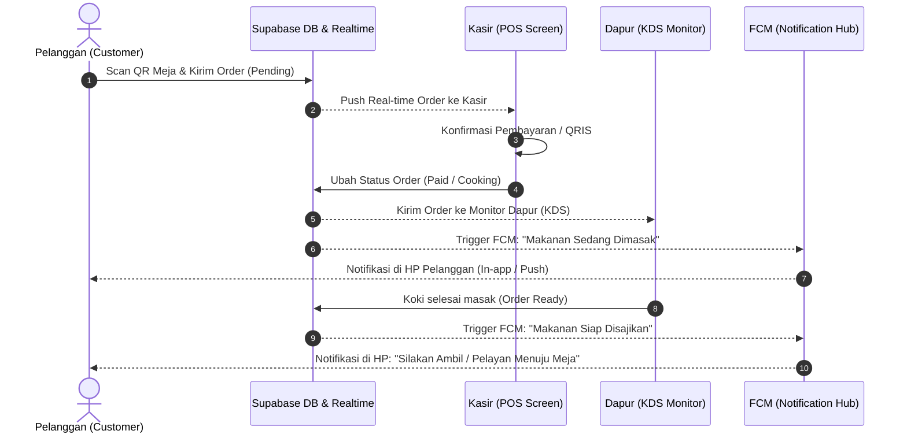

# Panduan Implementasi Peran Pelanggan (Customer User Implementation)
**Aplikasi: Parzello POS Mobile (ZelloPOS) - Ekosistem Omnichannel**  
**Tanggal Penyusunan: 1 Juni 2026**

---

## Pendahuluan

Ekspansi sistem **Parzello POS** dari aplikasi kasir internal (*Merchant-Facing App*) menjadi aplikasi yang juga dapat diakses langsung oleh pelanggan (*Customer-Facing App*) akan mengubah platform ini menjadi ekosistem **O2O (Online-to-Offline)** yang modern. 

Integrasi peran pelanggan (*Customer User*) ini tidak hanya meningkatkan kenyamanan pelanggan dalam memesan, tetapi juga mengoptimalkan efisiensi operasional *merchant* dengan memanfaatkan fitur-fitur yang sudah setengah jalan atau tersembunyi di codebase saat ini (seperti **Manajemen Meja**, **KDS**, **FCM Notifikasi**, dan **Sistem Voucher**).

---

## Arsitektur Alur Transaksi Pelanggan (O2O Ecosystem)

Dengan adanya aplikasi/antarmuka pelanggan (baik berupa Web App berbasis QR Code maupun Mobile App), alur transaksi akan terintegrasi secara langsung dengan sistem kasir dan dapur yang sudah ada:



---

## Fitur Utama Aplikasi Pelanggan (Customer-Facing Features)

Jika diimplementasikan, berikut adalah fitur-fitur utama yang dapat dilakukan oleh **Customer** langsung dari perangkat mereka, serta bagaimana fitur tersebut terintegrasi dengan kode Parzello POS yang sudah ada:

### 1. Pemesanan Mandiri Berbasis QR Code (Self-Service QR Ordering)
*   **Cara Kerja**: Pelanggan memindai kode QR yang tertempel di meja restoran. Kode QR tersebut mengarahkan ke halaman web katalog menu yang secara otomatis mengunci `table_id` dan `store_id` pelanggan.
*   **Integrasi Basis Kode**: 
    *   Mengaktifkan kembali fitur **Manajemen Meja** (`table_monitoring_screen.dart` dan `table_provider.dart`) yang saat ini disembunyikan.
    *   Ketika pelanggan mengirim pesanan, status meja otomatis berubah menjadi `occupied` (Terisi) secara real-time di layar monitor kasir dan dashboard.
*   **Benefit**: Mengurangi beban kerja kasir dalam mencatat pesanan manual dan mengeliminasi antrean di meja kasir.

### 2. Pembayaran Mandiri Digital & Bayar Pisah (Self-Checkout & Split Bill)
*   **Cara Kerja**: Pelanggan dapat langsung membayar pesanan mereka di meja menggunakan e-wallet (QRIS, GoPay, OVO, ShopeePay) tanpa perlu berjalan ke kasir.
*   **Integrasi Basis Kode**:
    *   Terintegrasi langsung dengan fitur **Split Bill** (`split_bill_screen.dart`). Beberapa pelanggan di meja yang sama dapat memindai QR meja yang sama, memilih menu yang mereka makan masing-masing, dan membayar bagian mereka sendiri-sendiri (*split bill* mandiri).
*   **Benefit**: Mempercepat perputaran meja (*table turnover rate*) di restoran, terutama pada jam-jam sibuk (*peak hours*).

### 3. Pelacakan Status Pesanan Real-Time (Real-Time Order Tracking)
*   **Cara Kerja**: Pelanggan dapat memantau estimasi waktu tunggu pesanan mereka, antrean ke berapa mereka berada, dan status persiapan makanan.
*   **Integrasi Basis Kode**:
    *   Terintegrasi dengan **Kitchen Display System (KDS)** (`kds_screen.dart`) yang akan dikembangkan. Saat koki mengubah status pesanan dari "Antre" -> "Dimasak" -> "Selesai", status tersebut langsung ter-update di layar HP pelanggan.
    *   Memanfaatkan **Notification Hub** dan **FCM** (`notification_provider.dart`) untuk mengirimkan notifikasi dorong (*push notification*) ketika makanan siap dijemput atau disajikan.

### 4. Dompet Voucher & Program Loyalitas (Loyalty Points & Digital Vouchers)
*   **Cara Kerja**: Pelanggan dapat mengumpulkan poin dari setiap kelipatan transaksi belanja dan menukarkannya dengan voucher diskon.
*   **Integrasi Basis Kode**:
    *   Terintegrasi dengan model **Voucher** (`lib/core/models/voucher.dart`) dan provider voucher (`voucher_provider.dart`) yang saat ini sudah ada di codebase.
    *   Pelanggan dapat memasukkan kode voucher atau memilih voucher yang tersedia di akun mereka saat checkout mandiri untuk memotong total tagihan secara otomatis.

### 5. Struk Pembayaran Digital Bebas Kertas (Paperless E-Receipt)
*   **Cara Kerja**: Setelah pembayaran berhasil, aplikasi pelanggan akan menerbitkan struk belanja digital yang ramah lingkungan (*eco-friendly*).
*   **Integrasi Basis Kode**:
    *   Mengambil data visual layout struk dari `receipt_screen.dart` dan mengubah kustomisasi struk (`receipt_customization_screen.dart`) menjadi representasi file PDF/Image atau HTML interaktif yang dapat diunduh atau dikirim via WhatsApp/Email.
*   **Benefit**: Menghemat biaya operasional pembelian kertas thermal roll untuk printer kasir.

### 6. Rekomendasi Menu Cerdas Berbasis AI & Cuaca (AI Smart Recommendation)
*   **Cara Kerja**: Aplikasi pelanggan menampilkan rekomendasi menu yang berubah secara dinamis menyesuaikan preferensi pribadi, waktu pemesanan (pagi/malam), dan kondisi cuaca di lokasi store.
*   **Integrasi Basis Kode**:
    *   Memanfaatkan API cuaca lokal (`OpenWeatherMap`) dan menyalurkannya ke modul **AI Smart Analytics** (`Plan Fitur AI.md`). Jika cuaca panas terik, AI akan merekomendasikan minuman dingin terlaris di karusel halaman utama aplikasi pelanggan.

---

## Perubahan Skema Database yang Diperlukan (Technical Database Extension)

Untuk mendukung peran pelanggan, skema database Supabase PostgreSQL saat ini perlu ditambahkan beberapa tabel baru:

```sql
-- 1. Tabel Data Pelanggan
CREATE TABLE customers (
    id UUID PRIMARY KEY DEFAULT gen_random_uuid(),
    store_id UUID REFERENCES stores(id) ON DELETE CASCADE,
    name VARCHAR(255) NOT NULL,
    phone VARCHAR(20) UNIQUE,
    email VARCHAR(255) UNIQUE,
    loyalty_points INT DEFAULT 0,
    created_at TIMESTAMP WITH TIME ZONE DEFAULT timezone('utc'::text, now()) NOT NULL
);

-- 2. Modifikasi Tabel Transactions
ALTER TABLE transactions 
ADD COLUMN customer_id UUID REFERENCES customers(id) ON DELETE SET NULL,
ADD COLUMN order_source VARCHAR(50) DEFAULT 'cashier'; -- 'cashier' atau 'customer_app'

-- 3. Tabel Ulasan & Umpan Balik (Untuk AI Sentiment Analysis Owner)
CREATE TABLE product_reviews (
    id UUID PRIMARY KEY DEFAULT gen_random_uuid(),
    transaction_id UUID REFERENCES transactions(id) ON DELETE CASCADE,
    product_id UUID NOT NULL,
    customer_id UUID REFERENCES customers(id) ON DELETE SET NULL,
    rating INT CHECK (rating >= 1 AND rating <= 5),
    review_text TEXT,
    created_at TIMESTAMP WITH TIME ZONE DEFAULT timezone('utc'::text, now()) NOT NULL
);
```

---

## Keuntungan bagi Skripsi & Pengembangan Akademis

Jika ide implementasi **Customer User** ini dimasukkan ke dalam bab rencana pengembangan masa depan (*Future Work*) atau diimplementasikan sebagian sebagai prototipe pada skripsi Anda, hal ini akan memberikan nilai tambah akademis yang sangat besar:

1.  **Kontribusi Keilmuan (Contribution of Work)**: Menunjukkan pemahaman mendalam tentang konsep **Human-Computer Interaction (HCI)** multi-user (Kasir, Koki, Owner, dan Pelanggan) dalam satu siklus hidup perangkat lunak (*software lifecycle*).
2.  **Validasi Sistem Offline-First**: Menguji keandalan *Sync Engine* ketika menghadapi konflik penulisan data masif dari puluhan pelanggan yang memesan secara bersamaan di bawah jaringan internet yang tidak stabil.
3.  **Pengayaan Dataset AI**: Data penilaian produk (*product reviews*) dan pola perilaku pemesanan mandiri oleh pelanggan akan menghasilkan dataset yang jauh lebih kaya bagi modul **AI Smart Analytics** untuk melakukan prediksi tren penjualan yang sangat akurat.
