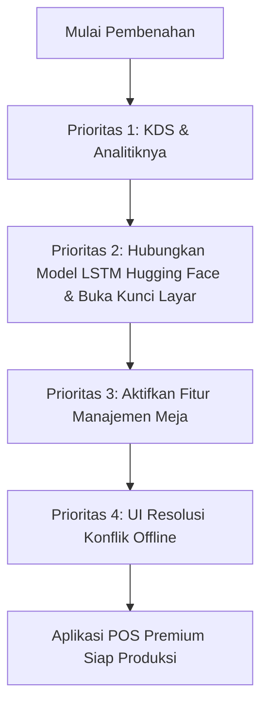

# Analisis Fitur & Komponen Setengah Selesai (Unfinished & Dormant Features)
**Aplikasi: Parzello POS Mobile (ZelloPOS)**  
**Versi Evaluasi: 1.5.0+8 (Android Target SDK 35 / Compile SDK 36)**  
**Tanggal Evaluasi: 1 Juni 2026**

---

## Pendahuluan

Dokumen ini merinci hasil audit teknis terhadap basis kode (*codebase*) **Parzello POS Mobile**. Evaluasi difokuskan untuk mengidentifikasi fitur-fitur yang telah direncanakan namun belum diimplementasikan sama sekali (hanya berupa *placeholder*/*coming soon*), fitur yang baru diimplementasikan di tingkat antarmuka pengguna saja (*mockup*/*simulated*), serta fitur yang secara fungsional sudah lengkap tetapi dalam kondisi disembunyikan (*dormant*/*hidden*) dari pengguna akhir karena keputusan bisnis/kebutuhan ritel sederhana.

Analisis ini bertujuan untuk memberikan peta jalan (*roadmap*) pengembangan yang jelas serta menjadi dokumentasi kritis pendukung bagi kebutuhan pertahanan akademis (skripsi) maupun kesiapan rilis produksi skala besar.

---

## 1. Modul Kitchen Display System (KDS)

### Deskripsi Status
*   **Status Aktual**: 🔴 **Belum Selesai (100% Placeholder / "Coming Soon")**
*   **File Utama**: `lib/features/kds/presentation/kds_screen.dart`

### Analisis Teknis
Di tingkat kode, file `kds_screen.dart` merupakan komponen `StatelessWidget` sederhana yang menyajikan antarmuka visual statis dengan pemberitahuan **"Segera Hadir!"** (KDS sedang dalam tahap pengembangan). Halaman ini hanya berisi tombol navigasi untuk kembali ke Dashboard.
*   **Tidak Ada Model Data**: Tidak ada model data kitchen order, antrean pesanan dapur, atau status pengerjaan yang dibuat di database lokal Isar maupun Supabase.
*   **Tidak Ada Logika Sinkronisasi**: Tidak ada penanganan sinkronisasi real-time antara kasir yang menginput pesanan makanan/minuman dengan monitor dapur.
*   **Absensi Integrasi Cetak Dapur**: Alur kerja pemisahan struk cetak (struk kasir vs kertas orderan koki di dapur) belum diimplementasikan.

### Dampak & Kesenjangan Analitik (Firebase Tracking Gap)
Berdasarkan dokumen perencanaan analitik (`Planning/Plan Penerapan Analitik.md`), terdapat tiga event penting pelacakan operasional dapur yang **sama sekali belum diimplementasikan**:
1.  `kds_start_cooking` (Ketika pesanan mulai diproses oleh juru masak).
2.  `kds_order_ready` (Ketika pesanan selesai dimasak dan siap diantar).
3.  `kds_order_served` (Ketika pesanan selesai disajikan ke pelanggan).

---

## 2. Modul AI Smart Analytics (Hugging Face LSTM Integration)

### Deskripsi Status
*   **Status Aktual**: 🟡 **Setengah Selesai (UI High-Fidelity & Simulasi Selesai, Integrasi Backend Belum Ada)**
*   **File Utama**: `lib/features/reports/presentation/smart_analytics_screen.dart` & `lib/features/reports/providers/analytics_provider.dart`

### Analisis Teknis
Antarmuka pengguna pada modul ini sangat premium, memanfaatkan bento-grid, grafik dari `fl_chart`, karusel rekomendasi harga (*smart pricing*), serta animasi *shimmer*. Namun, fungsionalitas kecerdasan buatannya berjalan di bawah sistem **simulasi client-side**:
*   **Kunci Akses Global (Locked Screen)**: Pada `smart_analytics_screen.dart` baris 32, variabel `static const bool _isLocked` disetel ke `true`. Ini mengunci seluruh layar di balik filter blur (`BackdropFilter` sigma 12) dengan pop-up bertuliskan *"Coming Soon - AI Pro Feature"*.
*   **Data Proyeksi & Kalibrasi AI Disimulasikan**:
    *   Fungsi kalibrasi AI (`_startCalibration`) hanya menjalankan perulangan timer `Future.delayed` selama 1,2 detik per tahap untuk mengubah progres bar secara visual (0% -> 100%) dan menampilkan teks log seolah-olah sistem sedang berinteraksi dengan API Model LSTM Hugging Face.
    *   Tombol `+ Simulasikan +5` ditambahkan langsung di UI untuk memicu pertambahan data transaksi simulasi secara instan guna memenuhi batas minimum latihan (20 transaksi).
    *   Peramalan omzet harian/mingguan/bulanan, jam ramai pelanggan (*traffic forecast*), serta produk terlaris menggunakan nilai statis keras (*hardcoded*) di dalam struktur `switch-case` di tingkat widget.
*   **Ketiadaan Model Caching Lokal (`AiInsightLocal`)**:
    *   Dalam `Plan Fitur AI.md`, direncanakan adanya skema lokal `AiInsightLocal` di database Isar untuk menghemat pemanggilan token API. Namun, model ini **tidak ditemukan** di folder `lib/core/models/` dan tidak teregistrasi dalam instance Isar.
*   **Tidak Ada Integrasi Supabase Edge Function**:
    *   Tidak ada pemanggilan RPC atau serverless function ke Supabase yang bertugas meneruskan data ringkasan ke API Model LSTM di Hugging Face.
    *   Modul `analytics_provider.dart` saat ini hanya mengumpulkan data kalkulasi agregat penjualan mentah (omzet riil lokal dan remote) tanpa keterlibatan model analitik prediktif.

---

## 3. Modul Manajemen Meja & Monitoring Meja

### Deskripsi Status
*   **Status Aktual**: 🟢🟢 **100% Selesai Secara Fungsional, Tetapi Dinonaktifkan/Disembunyikan (Dormant/Hidden Feature)**
*   **File Utama**:
    *   `lib/features/settings/presentation/manage_tables_screen.dart` (Pengaturan daftar meja & kapasitas)
    *   `lib/features/pos/presentation/table_monitoring_screen.dart` (Monitoring status meja terisi/kosong & split bill)
    *   `lib/features/pos/providers/table_provider.dart` & `table_monitoring_provider.dart` (Logika backend & lokal)

### Analisis Teknis
Tidak seperti KDS atau AI, fitur Manajemen Meja sebetulnya **sudah sepenuhnya selesai diimplementasikan**. Fitur ini mendukung pembuatan meja baru, penyuntingan kapasitas, deteksi status meja (`available`, `occupied`, `cleaning`, `reserved`), pembebasan meja pasca bayar, hingga split bill berdasarkan meja. Namun, fitur ini sengaja disembunyikan dari alur utama aplikasi:
*   **Penyembunyian Akses Dashboard**: Pada `dashboard_screen.dart` baris 114, variabel `hasTables` secara permanen disetel ke `false` (`const hasTables = false; // Sembunyikan untuk sementara waktu`). Ini menyembunyikan kartu akses navigasi ke halaman Monitoring Meja.
*   **Absensi di Pengaturan Toko**: Pada `settings_screen.dart`, tidak ada menu item yang mengarah ke `ManageTablesScreen` (`/tables`), sehingga pemilik toko tidak dapat mendaftarkan meja mereka secara mandiri melalui pengaturan resmi.
*   **Pengecualian Alur Checkout POS**: Antarmuka kasir utama (`pos_screen.dart`) tidak menyediakan opsi bagi kasir untuk memilih atau menautkan keranjang belanja ke ID meja tertentu. Kasir hanya dapat melayani transaksi ritel langsung *takeaway/dine-in* tanpa meja.

### Alasan Penonaktifan
Berdasarkan catatan rilis (`Release.md`), pengembang memutuskan menyembunyikan fitur ini demi merampingkan MVP (Minimum Viable Product) agar terfokus penuh pada operasional ritel umum dan F&B berkecepatan tinggi tanpa sistem tata letak meja (misalnya *booth* minuman, kedai *takeaway*).

---

## 4. Mekanisme Sinkronisasi Offline & Resolusi Konflik Data

### Deskripsi Status
*   **Status Aktual**: 🟡 **Setengah Selesai (Fungsional Dasar Berjalan, Fitur Resolusi Interaktif Belum Ada)**
*   **File Utama**: `lib/core/providers/sync_provider.dart`

### Analisis Teknis
Meskipun aplikasi sangat sukses menerapkan strategi *Offline-First* menggunakan flag `isSynced` dan `isDeleted` pada Isar DB lokal serta sinkronisasi latar belakang yang andal melalui `SyncNotifier`:
*   **Resolusi Konflik Sederhana (Last-Write-Wins)**: Jika terjadi benturan data (misalnya nama produk diubah secara offline di kasir A dan juga diubah di kasir B secara bersamaan), sistem akan menyelesaikan konflik secara sepihak menggunakan timestamp terbaru atau sekadar melakukan upsert paksa ke database Supabase Cloud.
*   **Tidak Ada Antarmuka Resolusi Konflik (Conflict Resolution UI)**: Merchant/owner tidak memiliki kontrol visual atau panel notifikasi khusus untuk memilih versi data mana yang ingin disimpan (lokal vs server) ketika terdeteksi adanya ketidakcocokan data krusial pasca pemulihan koneksi internet (*reconnection*).

---

## Kesimpulan & Rekomendasi Roadmap Prioritas

Untuk menyempurnakan aplikasi **Parzello POS Mobile** menuju kesiapan rilis komersil penuh serta memperkuat landasan metodologi penelitian akademis, berikut adalah rekomendasi prioritas pengembangan selanjutnya:

### Rekomendasi Langkah Kerja Rinci:

1.  **Langkah 1: Implementasi Modul Monitor Dapur (KDS)**
    *   Buat tabel database `kitchen_orders` di Supabase dan Isar DB.
    *   Buat real-time channel listener menggunakan Supabase Realtime agar status pesanan yang masuk ke dapur langsung ter-update di tablet juru masak secara instan.
    *   Pasang event Firebase Analytics (`kds_start_cooking`, dll.) untuk melacak durasi waktu memasak rata-rata toko.
2.  **Langkah 2: Integrasi Model LSTM Hugging Face Melalui Edge Function**
    *   Ubah flag `_isLocked` menjadi `false` di `smart_analytics_screen.dart`.
    *   Buat file model `lib/core/models/ai_insight_local.dart` dan daftarkan di basis data Isar.
    *   Tulis Supabase Edge Function dalam bahasa TypeScript/Deno yang memanggil model LSTM yang dihost di Hugging Face dengan aman menggunakan API token Hugging Face terenkripsi di server (menghindari kebocoran token di sisi client Flutter).
3.  **Langkah 3: Aktivasi Manajemen Meja (Untuk Pasar F&B Dine-In)**
    *   Buka kunci menu di `dashboard_screen.dart` dengan mengubah `hasTables` menjadi dinamis (misal, berdasarkan tipe bisnis toko yang dipilih saat onboarding: Ritel vs F&B).
    *   Tautkan navigasi pengaturan meja ke `settings_screen.dart` agar owner dapat mengonfigurasi tata letak meja mereka.
4.  **Langkah 4: Antarmuka Konflik Data Sinkronisasi**
    *   Bangun lembar bawah dialog (*Bottom Sheet*) penanganan konflik di menu Sinkronisasi Data untuk memperlihatkan komparasi kolom data lokal vs cloud yang bentrok, memberi wewenang penuh kepada owner untuk menekan tombol "Gunakan Data Lokal" atau "Gunakan Data Server".
