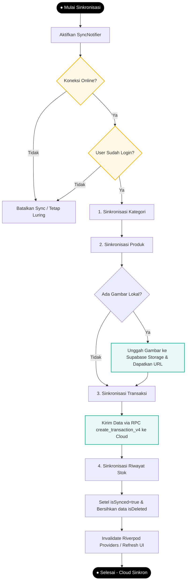
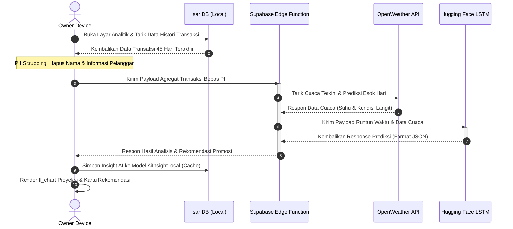

# Dokumen Arsitektur Sistem
**Aplikasi: Parzello POS Mobile (ZelloPOS)**  
**Platform: Flutter (Client), Supabase (Backend Cloud), Isar DB (Local Database), & Firebase Services**  
**Tanggal Penyusunan: 23 Juni 2026**

---

> **Catatan revisi 2026-07-13**: dokumen ini diverifikasi ulang terhadap kode aktual. Dua koreksi penting: (1) modul **AI Smart Analytics memanggil model LSTM Hugging Face langsung dari client Flutter** (`Env.lstmHfUrl`), **bukan** melalui perantara Supabase Edge Function seperti digambarkan pada diagram alur data global dan §5 di bawah — lihat catatan koreksi di §5.1; (2) **RBAC telah dilonggarkan signifikan** — router hanya membatasi `/staff-management` dan `/store-info` untuk non-owner (lihat ERD.md §3 dan Screen.md), bukan matriks akses ketat seperti yang tersirat di §2.3.

## Pendahuluan

Dokumen ini merinci rancangan **Arsitektur Sistem** untuk aplikasi **Parzello POS Mobile** (juga dikenal sebagai **ZelloPOS**). Sistem ini menggunakan pendekatan arsitektur terdistribusi *hybrid-cloud* yang membagi beban pemrosesan antara perangkat lokal (*client-side*) untuk keandalan operasional dan infrastruktur awan (*cloud backend*) untuk agregasi data, sinkronisasi, dan analisis kecerdasan buatan (AI).

Arsitektur Parzello POS dirancang khusus untuk memenuhi tiga kebutuhan utama bisnis retail dan F&B (Food and Beverage) berskala UMKM:
1. **Offline-First & High Availability**: Kasir tetap dapat bertransaksi penuh meskipun koneksi internet terputus, menggunakan database lokal Isar DB yang secara otomatis tersinkronisasi ketika koneksi pulih.
2. **Kinerja Tinggi & Responsif**: Manajemen state asinkron menggunakan Riverpod dan isolasi transaksi asinkron menjamin tidak adanya lag di antarmuka kasir.
3. **AI Smart Analytics & Telemetri**: Mengintegrasikan model analitik prediktif berbasis Model LSTM Kustom yang dihost di Hugging Face untuk membimbing pemilik toko dalam pengambilan keputusan bisnis secara real-time.

---

## 1. Arsitektur Sistem Global (High-Level Architecture)

Secara global, sistem Parzello POS Mobile terdiri dari empat komponen utama:
1. **Client-Side (Flutter Application & Isar DB)**: Aplikasi mobile kasir berbasis Flutter yang mengelola interaksi kasir, database lokal (cache offline), pemindaian barcode, dan pencetakan struk.
2. **Cloud Backend (Supabase Services)**: Layanan backend-as-a-service (BaaS) berbasis PostgreSQL yang mengelola autentikasi pengguna, penyimpanan data relasional terpusat, pengunggahan media struk/produk, dan pemrosesan logika server via RPC.
3. **Telemetry & Notification Hub (Firebase Services)**: Layanan Firebase untuk analisis perilaku merchant (Firebase Analytics) dan pengiriman notifikasi instan (Firebase Cloud Messaging - FCM).
4. **External API Integrations**: Layanan pihak ketiga seperti Model LSTM Kustom yang dihost di Hugging Face (untuk peramalan omzet dan analitik prediktif bisnis) serta OpenWeatherMap API (untuk menyelaraskan ramalan penjualan produk berdasarkan pola cuaca).

### Visualisasi Arsitektur Global & Alur Data (Mermaid)

```mermaid
graph TD
    subgraph Client_Side [Perangkat Mobile - Flutter Client]
        App[Flutter Core Application]
        Theme[Shadcn UI & Vibrant Lime Theme]
        Isar[(Local Database: Isar DB)]
        Print[Printer Service: Thermal Bluetooth/USB]
        Scanner[Mobile Barcode Scanner]
    end

    subgraph Firebase_Cloud [Firebase Services]
        FCM[Firebase Cloud Messaging]
        FA[Firebase Analytics]
    end

    subgraph Supabase_Backend [Supabase Cloud Infrastructure]
        Auth[Supabase Auth & OAuth Google]
        DB[(Supabase PostgreSQL)]
        Storage[Supabase Storage: Logo & Avatar]
        EF[Supabase Edge Functions: ai-analytics]
    end

    subgraph External_APIs [External Services]
        LSTM[Hugging Face Hosted LSTM Model]
        Weather[OpenWeatherMap API]
    end

    %% Hubungan Alur Data Client %%
    App -->|1. Tulis & Baca Instan| Isar
    App -->|2. Event Tracking| FA
    App -->|3. Cetak Struk| Print
    App -->|4. Scan SKU/Barcode| Scanner
    
    %% Sinkronisasi & Auth %%
    App -->|5. Autentikasi User| Auth
    App -->|6. Sync Data Background| DB
    App -->|7. Upload Media| Storage
    
    %% Notifikasi Push %%
    DB -->|8. Trigger Event| FCM
    FCM -->|9. Push Notification| App
    
    %% AI Smart Analytics %%
    App -->|10. Request Analisis| EF
    EF -->|11. Query Data Historis| DB
    EF -->|12. Fetch Cuaca Terkini| Weather
    EF -->|13. Send Time-Series Data| LSTM
    LSTM -->|14. JSON Forecast Insights| EF
    EF -->|15. Save Response Cache| DB
    EF -->|16. Send Format JSON| App

    %% Styles
    style Client_Side fill:#f5faff,stroke:#0066cc,stroke-width:2px
    style Supabase_Backend fill:#f0fbf7,stroke:#10b981,stroke-width:2px
    style Firebase_Cloud fill:#fff9f0,stroke:#f59e0b,stroke-width:2px
    style External_APIs fill:#fbf5ff,stroke:#8b5cf6,stroke-width:2px
```



---

## 2. Pembagian Lapisan Arsitektur (Layered Architecture)

Untuk menjamin skalabilitas, kemudahan pengujian, dan modularitas basis kode program, sisi klien (Flutter Client) dan server dirancang mengikuti pola arsitektur berlapis (*layered architecture*) yang memisahkan tanggung jawab kode program secara tegas:

```
+-----------------------------------------------------------------------+
|                       PRESENTATION LAYER (UI)                         |
|   - Flutter Screens & Widgets           - Shadcn UI Theme (Lime)      |
|   - Bouncing Scroll & Shimmer Loading   - Haptic Feedback & Debouncer |
+-------------------+---------------------------------------------------+
                    | Mengamati State & Memicu Aksi
                    v
+-------------------+---------------------------------------------------+
|                  APPLICATION LAYER (BUSINESS LOGIC)                   |
|   - Riverpod Providers & Notifiers      - GoRouter Navigation & Guards|
|   - Checkout / Split Bill Orchestration - AI Calibration Pipeline     |
+-------------------+---------------------------------------------------+
                    | Mengakses Entity & Validasi Aturan Bisnis
                    v
+-------------------+---------------------------------------------------+
|                            DOMAIN LAYER                               |
|   - Data Models (Product, Category)     - Business Rules & Validations|
|   - Role-Based Access Control Logic     - Time-Series Aggregates      |
+-------------------+---------------------------------------------------+
                    | Memuat & Menyimpan Data (Mapping / Serialization)
                    v
+-------------------+---------------------------------------------------+
|                             DATA LAYER                                |
|   - Isar Local Data Source              - Supabase Remote Data Source |
|   - Background Sync Engine              - Repository Implementations  |
+-------------------+---------------------------------------------------+
                    | Mengintegrasikan Layanan Sistem & Perangkat Keras
                    v
+-------------------+---------------------------------------------------+
|                        INFRASTRUCTURE LAYER (DEVICE)              |
|   - Bluetooth Printer Service           - Mobile Camera Barcode Scanner|
|   - Shared Preferences Config           - env.dart & Firebase Options |
+-----------------------------------------------------------------------+
```

### 2.1 Presentation Layer (UI Layer)
Lapisan ini mengurusi segala aspek visual yang berinteraksi langsung dengan pengguna akhir (Merchant Owner & Kasir).
*   **Komponen Visual**: Terdiri atas layar-layar utama (*Screens*) dan komponen kecil (*Widgets*) di dalam direktori `lib/features/<feature>/presentation/` dan komponen global di `lib/core/widgets/`.
*   **Spesifikasi Desain Premium**:
    *   Mengimplementasikan pustaka komponen **Shadcn UI** dengan skema warna *Luma Preset* (kombinasi Stone/Lime dengan warna primer hijau neon `#9AE600`).
    *   Penggunaan *floating rounded AppBars* dengan konfigurasi `extendBodyBehindAppBar = true` pada properti *Scaffold* untuk menciptakan efek visual mewah saat melakukan *scrolling*.
    *   Animasi transisi halus menggunakan efek *skeleton shimmer* selama proses pemuatan data, interaksi reaktif berbasis *haptic feedback* (getaran taktil) pada penekanan tombol kritis, dan efek pegas *bouncing physics* pada seluruh daftar gulir.
*   **Interaksi Input**: Menerapkan mekanisme **Debouncing (300ms)** pada kolom pencarian produk POS untuk mencegah pemuatan ulang (*rendering*) yang berlebihan di UI dan menjamin responsivitas ketikan kasir.

### 2.2 Application Layer (Business Logic Layer)
Lapisan ini bertindak sebagai koordinator aplikasi, menghubungkan input pengguna pada *Presentation Layer* dengan data dan aturan bisnis di lapisan bawahnya.
*   **Manajemen State**: Menggunakan **Riverpod** (`flutter_riverpod` + `riverpod_annotation`) untuk mengelola status data secara asinkron. Objek state diisolasi di dalam kelas Notifier (seperti `ProductNotifier` dan `StockHistoryNotifier`).
*   **Navigasi & Keamanan Route**: Dikelola oleh kelas [router.dart](file:///e:/SKRIPSI/Kholis/pos_mobile_fork/lib/core/router/router.dart) via `go_router`. Lapisan ini mengontrol alur navigasi aplikasi dan menegakkan kebijakan *Route Guard* (Onboarding, Login Guard, Store Selection Guard, dan Role-Based Access Control).
*   **Logika Fitur Kompleks**: Mengoordinasikan alur kerja proses checkout belanja kasir (transaksi), kalkulasi pemisahan tagihan (*split bill*), perintah pencetakan struk, pemindaian SKU, serta alur proses inisiasi latihan model AI (*AI calibration pipeline*).

### 2.3 Domain Layer (Core Business Layer)
Lapisan ini menyimpan representasi model data bisnis dan aturan-aturan mutlak operasional sistem (*enterprise business rules*).
*   **Entitas Bisnis (Data Models)**: Berupa kelas model Dart yang merepresentasikan objek dunia nyata, seperti `Category`, `Product`, `Store`, `TransactionLocal`, `TransactionItemLocal`, `StockHistoryLocal`, dan `NotificationLocalModel` di dalam direktori `lib/core/models/`.
*   **Aturan Bisnis & Validasi**:
    *   Validasi minimum transaksi (minimal 20 entri penjualan riil) sebelum modul kalibrasi AI diizinkan bekerja.
    *   Aturan pemotongan stok otomatis sewaktu transaksi POS berhasil dibuat.
    *   Definisi peran (*role*) dan matriks hak akses pengguna (Owner vs Karyawan/Kasir).
*   **Kemandirian Kode**: Lapisan ini dirancang bebas dari dependensi pustaka luar, murni merepresentasikan logika bisnis inti sistem.

### 2.4 Data Layer (Data Access & Storage Layer)
Lapisan ini bertanggung jawab untuk memuat, menyimpan, dan menyinkronkan data dari berbagai sumber data (*data sources*), baik lokal maupun cloud.
*   **Local Data Source (Isar DB)**: Mengakses database NoSQL lokal melalui kelas [isar_service.dart](file:///e:/SKRIPSI/Kholis/pos_mobile_fork/lib/core/database/isar_service.dart) untuk mendukung operasional luring kasir (offline-first).
*   **Remote Data Source (Supabase API)**: Berinteraksi dengan cloud server melalui SDK `supabase_flutter` untuk melakukan kueri tabel, mengunggah berkas logo/produk ke *storage bucket*, dan memicu *Remote Procedure Calls* (RPC).
*   **Serialization/Deserialization**: Mengelola konversi data dari objek Dart menjadi format penyimpanan lokal Isar DB atau JSON String payload untuk keperluan pengiriman data via API (maupun sebaliknya).
*   **Sync Engine**: Dikelola oleh kelas [sync_provider.dart](file:///e:/SKRIPSI/Kholis/pos_mobile_fork/lib/core/providers/sync_provider.dart) yang bertugas menjaga konsistensi data antara database Isar DB lokal dengan tabel Supabase Cloud PostgreSQL secara otomatis di latar belakang saat koneksi terdeteksi *online*.

### 2.5 Infrastructure Layer (Device & Hardware Integration Layer)
Lapisan terbawah yang menyediakan layanan integrasi dengan perangkat keras ponsel (*native device services*) dan konfigurasi sistem operasi.
*   **Printer Service**: Mengelola koneksi Bluetooth/USB ke printer thermal kasir (ukuran 58mm/80mm) menggunakan driver [printer_service.dart](file:///e:/SKRIPSI/Kholis/pos_mobile_fork/lib/core/services/printer_service.dart) berbasis pustaka `blue_thermal_printer`.
*   **Barcode Scanner**: Mengontrol fungsionalitas kamera ponsel untuk membaca kode barcode SKU secara instan menggunakan pustaka `mobile_scanner`.
*   **Local Notification Hub**: Memicu notifikasi tray sistem ponsel via `flutter_local_notifications` untuk pesan penting terkait hardware (seperti printer terputus).
*   **Connectivity Monitor**: Memantau status koneksi internet secara real-time via `connectivity_plus`.
*   **System Shared Preferences**: Menyimpan setelan konfigurasi ringan perangkat, seperti kode bahasa terpilih (`selected_language_code`) atau status terakhir kalibrasi AI toko.
*   **Konfigurasi Global**: Berisi berkas kredensial dan inisialisasi awal seperti [env.dart](file:///e:/SKRIPSI/Kholis/pos_mobile_fork/lib/core/env/env.dart) (URL/Key Supabase) dan `firebase_options.dart`.

---

## 3. Layanan Pihak Ketiga & Integrasi Eksternal (External Services)

Untuk mendukung kelengkapan fitur, keamanan, telemetri, dan kecerdasan buatan, Parzello POS terintegrasi secara modular dengan beberapa layanan pihak ketiga berikut:

```
               +------------------------------------------------+
               |               PARZELLO POS MOBILE              |
               +-------+-------------+------------+-------------+
                       |             |            |
     +-----------------+             |            +------------------+
     | HTTPS/WSS                     | HTTPS                         | HTTPS
     v                               v                               v
+----+-------------------+  +--------+-----------+  +----------------+----------------+
|    SUPABASE CLOUD      |  |   FIREBASE CLOUD   |  |        EXTERNAL SERVICES        |
| - Supabase Auth (JWT)  |  | - FCM (Push Notif) |  | - Hugging Face Hosted LSTM     |
| - PostgreSQL & RLS     |  | - Firebase Observ. |  |   (AI Sales Forecast & Pricing) |
| - Supabase Storage     |  +--------------------+  | - OpenWeatherMap API           |
| - Edge Functions / DB  |                          |   (Weather Condition Ingestion)|
+------------------------+                          +---------------------------------+
```

### 3.1 Supabase Cloud Services
Supabase bertindak sebagai tulang punggung infrastruktur serverless cloud:
*   **Supabase Auth**: Mengelola autentikasi pengguna secara terpusat dengan dukungan JWT (JSON Web Token) jangka pendek yang aman, metode penayangan verifikasi sandi, serta login sekali klik menggunakan Google Sign-In (OAuth).
*   **Supabase Database (PostgreSQL)**: Menyimpan basis data transaksional utama secara relasional. Dilengkapi dengan kebijakan *Row Level Security* (RLS) untuk membatasi akses data antar-merchant, indeks kinerja kueri, dan pemicu database (*triggers*).
*   **Supabase Storage**: Menyediakan *bucket* media terenkripsi (`logos` dan `products`) untuk menampung gambar produk makanan/barang dagangan dan logo profil toko.
*   **Supabase Edge Functions**: Lingkungan runtime Deno berbasis TypeScript untuk memproses webhook database yang sensitif (seperti memproses push notifikasi stok habis) dan melakukan *scrubbing* data sebelum diteruskan ke model LSTM.

### 3.2 Firebase Services
Layanan cloud dari Google untuk mengelola analitik operasional dan penyampaian notifikasi:
*   **Firebase Analytics**: Berperan mencatat dan melaporkan telemetri perilaku merchant secara real-time. Lapisan ini menangkap metrik-metrik bisnis penting seperti volume penjualan harian (`purchase`), perubahan persediaan (`adjust_stock`), integrasi pemisahan tagihan (`split_bill`), kustomisasi struk, hingga inisiasi kalibrasi AI (`ai_calibration`).
*   **Firebase Cloud Messaging (FCM)**: Mengelola infrastruktur pengiriman *Push Notification* dengan protokol HTTP v1 untuk menyampaikan pesan dari server ke ponsel milik Owner (seperti peringatan void transaksi kasir atau stok menipis).

### 3.3 Hugging Face Hosted LSTM Model
Pusat eksekusi analitik prediktif bisnis:
*   **Custom LSTM model**: Menampung model *deep learning* **LSTM (Long Short-Term Memory)** kustom yang dirancang khusus untuk memproyeksikan data runtun waktu (time-series).
*   **Fungsi Prediksi**: Model ini dihubungi oleh Supabase Edge Function untuk mengembalikan proyeksi omzet toko masa depan (*Sales Forecasting*), estimasi ramalan pengunjung harian (*Traffic Prediction*), dan menyusun rekomendasi diskon (*Smart Pricing*).

### 3.4 OpenWeatherMap API
*   **Contextual Weather Ingestion**: Menyediakan informasi cuaca terkini (suhu, kelembapan, status langit cerah/hujan) berdasarkan lokasi outlet toko secara real-time.
*   **Fungsi**: Data cuaca ini disisipkan ke dalam payload transaksi sebelum dikirim ke model LSTM Hugging Face, sehingga model AI mampu memprediksi penjualan produk terlaris berdasarkan cuaca (contoh: memproyeksikan es kopi latte naik 25% ketika suhu di atas 34°C).

---

## 4. Arsitektur Sinkronisasi (Offline-First Sync Engine)

Inti kekuatan operasional Parzello POS terletak pada modul sinkronisasi data transaksional latar belakang yang diatur oleh kelas [sync_provider.dart](file:///e:/SKRIPSI/Kholis/pos_mobile_fork/lib/core/providers/sync_provider.dart) (`SyncNotifier`).



### 4.1 Deteksi Jaringan Real-Time
Aplikasi memantau status jaringan menggunakan paket `connectivity_plus`. Kelas `ConnectivityNotifier` memaparkan status konektivitas perangkat (`online` atau `offline`) kepada `SyncNotifier`.
*   Ketika terdeteksi perubahan status dari `offline` ke `online`, sistem secara otomatis memvalidasi keaktifan token sesi Supabase via `ensureValidSession()`.
*   Jika sesi valid dan pengguna telah masuk, proses sinkronisasi latar belakang dipicu secara instan tanpa mengganggu tugas kasir.

### 4.2 Urutan Sinkronisasi Terjadwal (Dependency Order)
Sinkronisasi dijalankan dalam antrean linier untuk menghormati relasi integritas database di cloud (foreign key constraints):
1.  **Kategori (`syncCategories`)**: Kategori lokal diunggah terlebih dahulu via operasi `upsert`. Kategori yang memiliki status `isDeleted == true` akan dihapus dari cloud dan database lokal.
2.  **Produk (`syncProducts`)**: 
    *   Jika produk baru memiliki gambar lokal (`localImagePath`), file diunggah ke *Supabase Storage* terlebih dahulu.
    *   Setelah URL gambar cloud diperoleh, produk beserta detail harganya diunggah ke tabel `products` cloud.
3.  **Transaksi (`syncTransactions`)**: Nota penjualan lokal beserta daftar belanja item diunggah dalam satu paket parameter terstruktur menuju PostgreSQL RPC `create_transaction_v4`. Server akan memverifikasi harga, mencatat nota transaksi, dan memotong stok di cloud secara aman.
4.  **Riwayat Stok (`syncStockHistory`)**: Log audit perubahan stok barang diunggah ke tabel `stock_history` cloud untuk sinkronisasi histori penyesuaian inventaris.

### 4.3 Penanganan Konflik
*   **isSynced Flag**: Setiap baris data di Isar DB memiliki kolom boolean `isSynced`. Data yang baru dibuat atau diubah secara lokal diinisialisasi dengan nilai `false`. Setelah server cloud merespon sukses, nilai diubah menjadi `true`.
*   **Retry Engine**: Jika sinkronisasi gagal di tengah jalan akibat kegagalan jaringan temporer, pesan kesalahan dicatat pada kolom `syncError`, dan `SyncNotifier` akan menjadwalkan upaya sinkronisasi ulang secara berkala.

---

## 5. Arsitektur Modul AI Smart Analytics

Modul Smart Analytics menyediakan prediksi bisnis bernilai tinggi bagi pemilik toko (Owner) dengan memanfaatkan pemrosesan analitik hibrida.

### 5.1 Aliran Proses AI & PII Scrubbing (Privacy Guard)

> **Koreksi implementasi**: berdasarkan pemeriksaan `lib/features/reports/providers/smart_analytics_provider.dart`, pemanggilan model dilakukan **langsung dari aplikasi Flutter ke URL Hugging Face** (`Env.lstmHfUrl`), **tanpa Supabase Edge Function sebagai perantara**. Hasil analitik disimpan langsung ke tabel `smart_analytics_snapshots` oleh client. Langkah "PII Scrubbing" eksplisit sebagai proses terpisah juga tidak ditemukan sebagai kode aktif — payload yang dikirim ke model LSTM secara desain hanya berisi data agregat (total, kuantitas, kategori, waktu), namun belum ada mekanisme scrubbing/masking eksplisit yang terverifikasi di kode. Poin 1–4 di bawah dipertahankan sebagai **rancangan/tujuan desain (NFR)** dan perlu ditandai sebagai belum sepenuhnya terimplementasi bila dipakai untuk penilaian akademis.

Untuk menjaga privasi pelanggan dan mematuhi kriteria non-fungsional keamanan (NFR), sistem *seharusnya* menerapkan mekanisme **PII Scrubbing** sebelum mengirimkan payload data transaksi ke model AI:
1.  **Local Data Retrieval**: Data histori transaksi ditarik dari Isar DB lokal secara teragregasi.
2.  **Scrubbing & Masking**: Informasi pribadi seperti nama pelanggan, nomor telepon, dan nomor kartu debit dibersihkan sepenuhnya. AI hanya menerima data numerik berupa total transaksi, kuantitas item, kategori, waktu transaksi, dan ID produk.
3.  **External Context Ingestion**: Sistem menyertakan data kondisi cuaca saat ini dari OpenWeatherMap API untuk memberikan konteks kondisi cuaca luar terhadap performa penjualan produk tertentu.
4.  **Cloud Inference Call (rancangan)**: Data agregat idealnya dikirimkan melalui *Supabase Edge Function* sebagai perantara ke **Model LSTM Kustom di Hugging Face** — pada implementasi berjalan saat ini, panggilan dilakukan langsung dari client tanpa perantara Edge Function.



### 5.2 Fitur Analitik Prediktif
Hasil respons analisis LSTM Hugging Face didekode di sisi klien untuk memicu beberapa fitur cerdas:
*   **Sales Forecasting (Ramalan Penjualan)**: Menyajikan estimasi omzet penjualan harian, mingguan, atau bulanan berikutnya. Data divisualisasikan menggunakan grafik garis reaktif `fl_chart`, di mana garis solid melambangkan data transaksi riil historis, dan garis putus-putus (*dotted line*) berwarna neon melambangkan proyeksi masa depan dari AI.
*   **Smart Traffic Prediction (Prediksi Kunjungan)**: Memberikan proyeksi tingkat kunjungan pelanggan per jam untuk mengoptimalkan pembagian jadwal kerja karyawan kasir.
*   **Best-Seller Prediction (Prediksi Produk Terlaris)**: Menggabungkan data historis dan cuaca untuk memprediksi produk yang akan mengalami lonjakan permintaan (misal: "Suhu esok hari terik 34°C, es kopi diproyeksikan naik 30%").
*   **Smart Pricing (Rekomendasi Promosi dengan CTA)**: AI menyusun rekomendasi diskon happy hour untuk menipiskan stok barang mati (*deadstock*). Pada antarmuka pengguna, kartu rekomendasi dilengkapi tombol aksi `"Terapkan Promo"` yang jika diklik akan mendaftarkan kode diskon tersebut secara otomatis ke database POS lokal agar siap digunakan saat kasir checkout.

---

## 6. Keamanan Data & Kebijakan Enkripsi

Parzello POS menerapkan prinsip keamanan menyeluruh untuk menjaga integritas transaksi keuangan merchant:
*   **Autentikasi Terenkripsi**: Menggunakan modul Supabase Auth dengan protokol keamanan standar industri (JWT tokens) dan integrasi login aman sekali klik via Google Sign-In.
*   **Local Data Encryption**: Isar Database lokal mematuhi sistem isolasi sandbox aplikasi OS (Android/iOS) sehingga data lokal tidak dapat diakses secara bebas oleh aplikasi lain tanpa izin root/jailbreak.
*   **Secure API Transport**: Seluruh komunikasi data dengan Supabase API dan Firebase Services diwajibkan menggunakan jalur transmisi aman terenkripsi (HTTPS & WSS).
*   **Token Sesi Valid**: Sesi pengguna divalidasi dan diperbarui tokennya secara berkala lewat *interceptors* sebelum sync engine berinteraksi dengan server untuk mencegah pemalsuan data transaksi.

---
*Dokumen Arsitektur Sistem ini dirinci untuk memberikan panduan pembangunan dan integrasi sistem Parzello POS Mobile yang kokoh, tangguh dalam kondisi offline, dan cerdas berbasis AI.*
