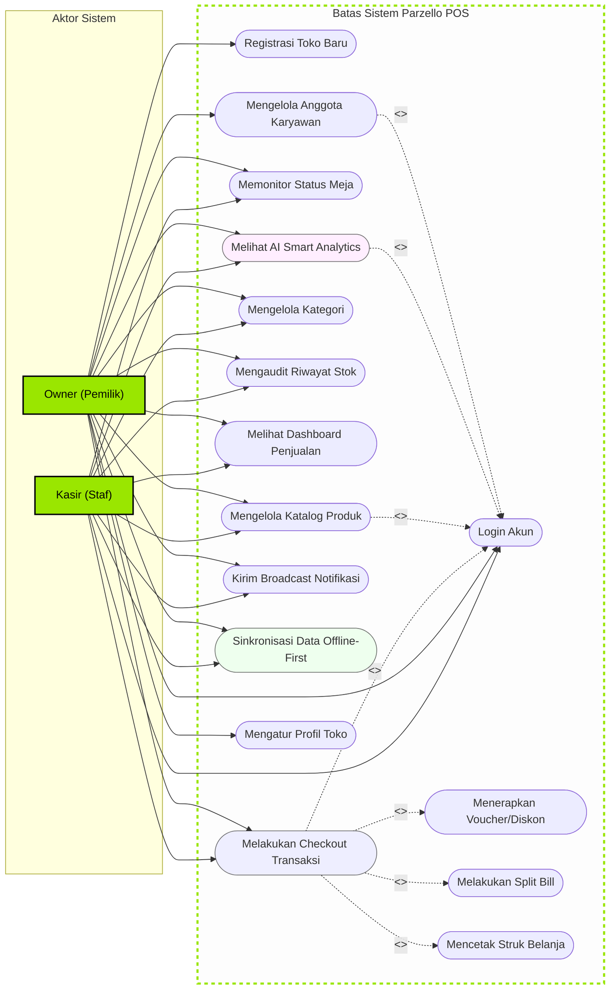

# Dokumentasi Use Case Diagram & Skenario Sistem
**Aplikasi: Parzello POS Mobile (ZelloPOS)**  
**Tanggal Penyusunan: 1 Juni 2026**

---

## Pendahuluan

Dokumen ini merinci model **Use Case Diagram** beserta skenario spesifikasi fungsional untuk aplikasi **Parzello POS Mobile**. Pemodelan ini bertujuan untuk menjabarkan batasan sistem (*system boundary*), interaksi antara aktor (pengguna) dengan fungsionalitas sistem, serta relasi dependensi antar-fungsi (`<<include>>` dan `<<extend>>`).

Dokumen ini disusun menggunakan standar pemodelan perangkat lunak untuk mendukung penyusunan dokumen skripsi/akademis yang terstruktur dan siap uji.

> **Direvisi 2026-07-13**: sejak penyesuaian RBAC (*"Penyesuaian Fitur Role Kasir"*), sebagian besar batasan akses Owner-eksklusif yang tergambar di versi dokumen sebelumnya sudah dilonggarkan di kode aplikasi. Kasir kini dapat mengakses Dashboard, Laporan, Manajemen Produk & Kategori, dan AI Smart Analytics — hanya Manajemen Staf dan Info Toko yang tetap eksklusif Owner (lihat `router.dart`, ERD.md, dan Screen.md). Fitur "Pelanggan" yang sebelumnya ditandai *opsional/masa depan* **sudah diimplementasikan penuh** sebagai mode self-order terpisah (`lib/features/customer/`).

---

## Aktor Sistem (System Actors)

Sistem Parzello POS mengidentifikasi tiga aktor utama yang berinteraksi dengan aplikasi:

1.  **Owner (Pemilik Toko)**:
    Aktor dengan hak istimewa tertinggi (*super-user*). Secara teknis, satu-satunya hak eksklusif Owner di level router adalah manajemen data karyawan (`/staff-management`) dan pengaturan identitas toko (`/store-info`). Owner tetap menjadi penanggung jawab utama konfigurasi toko dan pengambilan keputusan strategis berbasis laporan/AI Smart Analytics.
2.  **Karyawan / Kasir**:
    Staf operasional harian toko. Sejak penyesuaian RBAC, kasir memiliki akses yang jauh lebih luas dari sebelumnya: pelayanan penjualan (POS), pencetakan & kustomisasi struk, manajemen produk & kategori, audit/penyesuaian stok, laporan penjualan, broadcast notifikasi, dan AI Smart Analytics — kecuali manajemen staf dan info toko yang tetap eksklusif Owner.
3.  **Pelanggan (Customer)**:
    Aktor eksternal yang memesan menu mandiri melalui mode katalog self-order (`/customer/*`), tanpa perlu login sebagai staf toko. Fitur ini **sudah terimplementasi penuh** (bukan lagi rencana masa depan), mencakup pencarian toko, keranjang, checkout, pelacakan pesanan, riwayat, dan program loyalitas.

---

## Diagram Use Case Utama (Mermaid Flowchart)

Mermaid diagram berikut memodelkan sistem batas (*system boundary*) Parzello POS dengan memetakan asosiasi aktor ke setiap lingkaran *use case*, termasuk relasi ketergantungan `include` (fungsi yang wajib dijalankan) dan `extend` (fungsi opsional di bawah syarat tertentu).

---

## Spesifikasi Use Case (Kamus Use Case)

Daftar berikut merinci fungsi dari masing-masing *use case* yang digambarkan pada diagram di atas:

| ID | Nama Use Case | Aktor Utama | Deskripsi Singkat |
| :--- | :--- | :--- | :--- |
| **UC-01** | Registrasi Toko Baru | Owner | Mendaftarkan akun toko baru saat inisialisasi awal sistem. |
| **UC-02** | Login Akun | Owner, Kasir | Autentikasi pengguna menggunakan email dan kata sandi. |
| **UC-03** | Melakukan Checkout | Owner, Kasir | Memasukkan pesanan ke keranjang dan memproses transaksi bayar. |
| **UC-04** | Menerapkan Voucher | Owner, Kasir | Memasukkan kode promosi voucher belanja untuk memotong tagihan. |
| **UC-05** | Melakukan Split Bill | Owner, Kasir | Memecah pembayaran satu nota belanja menjadi beberapa bill. |
| **UC-06** | Mencetak Struk Belanja | Owner, Kasir | Mencetak struk transaksi fisik melalui printer thermal Bluetooth. |
| **UC-07** | Memonitor Status Meja | Owner, Kasir | Memantau keterisian meja secara visual, terintegrasi di alur POS (bukan screen terpisah). |
| **UC-08** | Mengelola Katalog | Owner, Kasir | Menambah, menyunting, dan menghapus produk atau stok barang. Tidak lagi dibatasi router untuk Owner saja. |
| **UC-09** | Mengelola Kategori | Owner, Kasir | Mengatur pengelompokan menu katalog produk toko. Tidak lagi dibatasi router untuk Owner saja. |
| **UC-10** | Mengaudit Riwayat Stok | Owner, Kasir | Melihat log keluar-masuk mutasi barang untuk mencegah fraud. |
| **UC-11** | Melihat Dashboard | Owner, Kasir | Memantau performa keuangan toko. |
| **UC-12** | Melihat AI Analytics | Owner, Kasir | Melihat proyeksi omzet cerdas berbasis Model LSTM di Hugging Face, beserta riwayat hasil analitik sebelumnya (`SmartAnalyticsHistoryScreen`) dan modul Performa Penjualan (`SalesPerformanceScreen`). Tidak lagi dibatasi router untuk Owner saja. |
| **UC-13** | Kirim Broadcast Notif | Owner, Kasir | Mengirim pesan push pemberitahuan real-time ke staf toko. Tidak lagi dibatasi router untuk Owner saja. |
| **UC-14** | Sinkronisasi Data | Owner, Kasir | Menyinkronkan antrean transaksi offline lokal ke cloud Supabase. |
| **UC-15** | Mengelola Karyawan | Owner | Mendaftarkan atau mengubah peran staf kasir. Satu-satunya use case yang tetap diblokir router untuk non-owner. |
| **UC-16** | Mengatur Profil Toko | Owner | Mengubah identitas nama toko, alamat, dan logo outlet. Tetap diblokir router untuk non-owner. |

---

## Skenario Deskriptif Use Case (Use Case Scenarios)

Berikut adalah skenario alur kejadian (*flow of events*) rinci untuk tiga fungsionalitas paling krusial di dalam sistem Parzello POS:

### Skenario 1: Melayani Transaksi POS Kasir (UC-03)
*   **Aktor Utama**: Kasir / Owner
*   **Kondisi Awal (Pre-Condition)**: Kasir sudah berhasil masuk (login) ke aplikasi dan keranjang belanja dalam keadaan kosong.
*   **Kondisi Akhir (Post-Condition)**: Transaksi tersimpan secara lokal di database Isar, struk belanja dicetak, dan stok produk berkurang.

| Alur Utama (Normal Flow) - Aksi Aktor | Reaksi Sistem |
| :--- | :--- |
| 1. Kasir membuka modul Kasir (POS Screen). | 2. Sistem menampilkan katalog produk per kategori. |
| 3. Kasir mengetik SKU/nama produk di pencarian atau memindai barcode SKU menggunakan kamera native. | 4. Sistem menyaring katalog dan menampilkan produk yang dicari secara instan. |
| 5. Kasir mengetuk produk untuk dimasukkan ke keranjang belanja. | 6. Sistem menambahkan produk ke keranjang, mengalkulasi subtotal, dan memperbarui angka lencana keranjang belanja. |
| 7. Kasir membuka lembar keranjang belanja (*Cart Sheet*). | 8. Sistem menampilkan detail item belanjaan kasir. |
| 9. (Opsional) Kasir memasukkan voucher belanja. | 10. Sistem memotong nilai total tagihan sesuai kalkulasi voucher. |
| 11. Kasir menekan tombol "Bayar" dan memilih metode pembayaran (Tunai). | 12. Sistem membuka layar pembayaran dan meminta kasir memasukkan nominal uang diterima. |
| 13. Kasir memasukkan jumlah uang tunai yang diterima dan menekan "Konfirmasi Pembayaran". | 14. Sistem menghitung kembalian, menyimpan transaksi di Isar DB lokal, mengurangi stok produk di database lokal, dan menampilkan dialog transaksi sukses. |
| 15. Kasir menekan tombol "Cetak Struk". | 16. Sistem menyusun layout nota dan mengirimkannya ke printer Bluetooth thermal yang terhubung. |

---

### Skenario 2: Melihat & Merefresh AI Smart Analytics (UC-12)
*   **Aktor Utama**: Owner, Kasir
*   **Kondisi Awal**: Pengguna berada di halaman Smart Analytics (`smart_analytics_screen.dart`), toko memiliki data transaksi historis untuk dianalisis.
*   **Kondisi Akhir**: Hasil prediksi LSTM (Hugging Face) tersaji di layar dan disimpan sebagai snapshot baru di tabel `smart_analytics_snapshots` untuk dapat dilihat kembali via riwayat.

| Alur Utama (Normal Flow) - Aksi Aktor | Reaksi Sistem |
| :--- | :--- |
| 1. Pengguna menekan menu "Smart Analytics". | 2. Sistem menampilkan hasil analitik terakhir (bila ada) atau memuat data baru. |
| 3. Pengguna menekan tombol refresh/muat ulang analitik. | 4. Aplikasi memanggil endpoint model LSTM (`Env.lstmHfUrl`, di-hosting Hugging Face) secara langsung dari client dengan data agregat penjualan, tanpa melalui Supabase Edge Function perantara. |
| | 5. Sistem menampilkan status loading/cold-start warning bila server prediksi baru bangun dari idle (`cold_start_warning`), lalu merender hasil dan menyimpannya sebagai baris baru di `smart_analytics_snapshots`. |
| | 6. Sistem menyajikan visualisasi grafik peramalan omzet, jam sibuk pelanggan, rekomendasi harga dinamis (*smart pricing*), dan estimasi menu terlaris. |
| 7. Pengguna dapat membuka `/smart-analytics/history` untuk meninjau hasil analitik dari sesi sebelumnya. | 8. Sistem menampilkan daftar snapshot historis tanpa perlu memanggil ulang model. |

> **Catatan koreksi dari versi dokumen sebelumnya**: alur "halaman terkunci (*Locked Backdrop Blur*)", "pop-up persetujuan privasi/*Agreement Dialog*", "minimal 20 entri riwayat penjualan", dan langkah eksplisit "PII scrubbing" via Supabase Edge Function **tidak ditemukan aktif di kode saat ini** — flag pengunci `_isLocked` pada `smart_analytics_screen.dart` bernilai `false` (hardcoded nonaktif), dan pemanggilan model LSTM dilakukan langsung dari client Flutter ke URL Hugging Face, bukan lewat Edge Function perantara. Elemen-elemen ini kemungkinan adalah desain awal yang belum/tidak jadi diimplementasikan sepenuhnya — jika akan dipakai untuk laporan skripsi sebagai *rencana desain*, sebaiknya ditandai eksplisit sebagai "rancangan awal, belum diimplementasikan" agar tidak menyesatkan penguji yang mengecek kode.

---

### Skenario 3: Sinkronisasi Data Otomatis di Latar Belakang (UC-14)
*   **Aktor Utama**: Owner / Kasir (Tidak sadar/Latar Belakang) atau dipicu Manual
*   **Kondisi Awal**: Perangkat sebelumnya dalam keadaan luring (*offline*) dan baru saja mendapatkan kembali koneksi internet (*online*).
*   **Kondisi Akhir**: Seluruh data transaksi lokal tersinkronkan ke Supabase Cloud dan status produk lokal diperbarui ke cloud.

| Alur Utama (Normal Flow) - Aksi Aktor | Reaksi Sistem |
| :--- | :--- |
| | 1. Sensor konektivitas mendeteksi status beralih ke *Online*. |
| | 2. Sistem meluncurkan modul `SyncNotifier` secara otomatis di latar belakang. |
| | 3. Sistem menyeleksi antrean kategori lokal yang bertanda `isSynced = false`, lalu melakukan *upsert* ke Supabase Cloud. Setelah sukses, disusul dengan sinkronisasi data produk luring. |
| | 4. Sistem menyeleksi transaksi luring lokal di Isar DB, menyusun payload RPC SQL, dan mengunggahnya ke tabel `transactions` dan `transaction_items` di Supabase. |
| | 5. Sistem menandai baris transaksi lokal dengan bendera `isSynced = true`. |
| | 6. Sistem memperbarui log mutasi stok produk di tabel `stock_histories` cloud agar audit stok tetap sinkron. |
| | 7. Sistem memicu pemberitahuan Toast sukses di layar perangkat: *"Sinkronisasi selesai! Data offline berhasil diunggah ke cloud."* |
