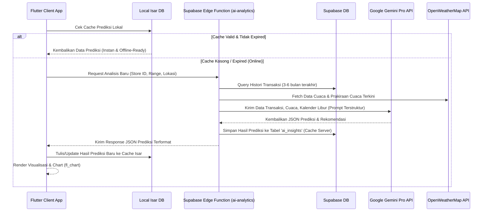

# Rencana Implementasi Fitur AI Smart Analytics

Dokumen ini merinci perencanaan, arsitektur, skema data, dan peta jalan (roadmap) untuk mereformasi halaman **Smart Analytics (`smart_analytics_screen.dart`)** dari tampilan placeholder menjadi dashboard analisis bisnis premium bertenaga kecerdasan buatan (AI) di aplikasi **POS Mobile**.

---

## 1. Arsitektur & Alur Integrasi AI

Sistem AI dirancang untuk meminimalkan beban komputasi di sisi klien (mobile device) dengan memindahkan logika analisis berat ke server menggunakan **Supabase Edge Functions** dan **Google Gemini Pro API**. Hasil analisis akan disimpan di database untuk efisiensi biaya API (caching) dan disinkronisasikan ke local cache **Isar DB** agar dapat diakses secara instan serta mendukung mode offline.

### Diagram Alur Komunikasi AI


---

## 2. Matriks Parameter Input & Output AI

Untuk menghasilkan akurasi prediksi yang tinggi dan rekomendasi yang aplikatif bagi pemilik toko, AI akan menganalisis multi-variabel berikut:

### A. Variabel Input AI (Data yang Dianalisis)
| Kategori Variabel | Data Spesifik yang Dikirim | Sumber Data | Tujuan Analisis |
| :--- | :--- | :--- | :--- |
| **Histori Transaksi** | Volume transaksi harian, total rupiah penjualan, kuantitas per produk | Supabase DB / Isar DB | Memetakan baseline performa toko & kecepatan perputaran barang. |
| **Jam Ramai** | Waktu spesifik transaksi (timestamp) | Supabase DB | Menentukan distribusi beban transaksi per jam (pagi, siang, sore, malam). |
| **Hari Tertentu** | Hari dalam seminggu (Senin - Minggu) | Kalender Sistem | Mendeteksi pola berkala mingguan (weekend surge vs. weekday slump). |
| **Musim/Libur** | Tanggal merah, libur sekolah, hari raya nasional | Static Metadata / API Kalender | Memprediksi pergeseran perilaku belanja selama liburan panjang. |
| **Cuaca** | Suhu rata-rata harian, status cuaca (Cerah, Berawan, Hujan) | OpenWeatherMap API | Mengaitkan suhu & cuaca luar ruangan dengan preferensi tipe menu. |
| **Trend Produk** | Kecepatan penjualan produk dalam 7-14 hari terakhir | Supabase DB | Mengidentifikasi lonjakan minat produk yang sedang naik daun. |

### B. Proyeksi Output AI (Hasil Prediksi & Rekomendasi)
| Fitur Utama | Output Spesifik AI | Representasi di UI | Value bagi Pengguna |
| :--- | :--- | :--- | :--- |
| **Sales Forecasting** | Estimasi nominal omzet harian/mingguan/bulanan, proyeksi volume transaksi | Line Chart (`fl_chart`) & Card Metrik | Mempersiapkan target bisnis, modal, kas laci, dan ekspektasi laba. |
| **Smart Traffic Prediction** | Estimasi jumlah pengunjung per jam (foot traffic estimation) | Bar Chart Distribusi Jam | Optimalisasi pembagian shift karyawan dan jam operasional toko. |
| **Smart Pricing** | Rekomendasi diskon Happy Hour, promo bundling produk, diskon cuci gudang | Carousel Card Interaktif | Mengurangi sisa stok (deadstock) & mendongkrak penjualan di jam sepi. |
| **Best-Seller Prediction** | Prediksi menu terlaris besok/minggu depan, menu trending, kategori berkembang | Grid Menu dengan Badge Tren | Mempersiapkan bahan baku (inventory procurement) secara presisi sebelum habis. |

---

## 3. Desain Skema Database & Caching

### A. Server-Side Cache (Supabase Table)
Untuk mencegah eksploitasi API Gemini yang berlebihan (cost control), kita membuat tabel `ai_insights` di Supabase untuk menyimpan hasil prediksi selama 24 jam.

```sql
CREATE TABLE public.ai_insights (
    id UUID DEFAULT gen_random_uuid() PRIMARY KEY,
    store_id UUID NOT NULL REFERENCES public.stores(id) ON DELETE CASCADE,
    type VARCHAR(50) NOT NULL, -- 'sales_forecast', 'pricing_rec', 'best_sellers', 'all'
    prediction_range VARCHAR(20) NOT NULL, -- 'daily', 'weekly', 'monthly', 'custom'
    prediction_date DATE NOT NULL DEFAULT CURRENT_DATE,
    payload JSONB NOT NULL, -- Struktur data detail prediksi AI
    created_at TIMESTAMP WITH TIME ZONE DEFAULT timezone('utc'::text, now()) NOT NULL,
    expired_at TIMESTAMP WITH TIME ZONE DEFAULT (timezone('utc'::text, now()) + interval '24 hours') NOT NULL
);

-- Indexing untuk performa query cepat
CREATE INDEX idx_ai_insights_store_range ON public.ai_insights(store_id, prediction_range, prediction_date);

-- RLS Policy
ALTER TABLE public.ai_insights ENABLE ROW LEVEL SECURITY;

CREATE POLICY "Users can view AI insights for their stores"
    ON public.ai_insights
    FOR SELECT
    USING (
        store_id IN (
            SELECT store_id FROM public.store_members WHERE user_id = auth.uid()
        )
    );
```

### B. Client-Side Cache (Isar Database Model)
Mendukung akses offline instan. Ketika aplikasi tidak terhubung ke internet, dashboard tetap menampilkan hasil analisis terakhir.

```dart
// lib/core/models/ai_insight_local.dart
import 'package:isar/isar.dart';

part 'ai_insight_local.g.dart';

@collection
class AiInsightLocal {
  Id id = Isar.autoIncrement;

  @Index(unique: true, replace: true)
  late String storeId;

  late String lastUpdated;
  
  // Payload JSON disimpan sebagai String untuk fleksibilitas schema
  late String salesForecastJson;
  late String pricingRecommendationsJson;
  late String bestSellersJson;
}
```

---

## 4. Struktur Data & Model Dart

Model terstruktur untuk memetakan response JSON dari AI Gemini ke dalam objek Dart yang aman:

```dart
// lib/features/reports/models/ai_insight_model.dart

class SalesForecast {
  final DateTime date;
  final double estimatedRevenue;
  final int estimatedTransactions;
  final int estimatedTraffic; // estimasi jumlah pengunjung

  SalesForecast({
    required this.date,
    required this.estimatedRevenue,
    required this.estimatedTransactions,
    required this.estimatedTraffic,
  });

  factory SalesForecast.fromJson(Map<String, dynamic> json) {
    return SalesForecast(
      date: DateTime.parse(json['date']),
      estimatedRevenue: (json['estimated_revenue'] as num).toDouble(),
      estimatedTransactions: (json['estimated_transactions'] as num).toInt(),
      estimatedTraffic: (json['estimated_traffic'] as num).toInt(),
    );
  }
}

class PricingRecommendation {
  final String id;
  final String title; // "Promo Happy Hour", "Bundling Akhir Pekan", "Diskon Stok Lambat"
  final String description;
  final String badgeText; // "REKOMENDASI PROMO" / "DISKON DINAMIS"
  final List<String> targetProductIds;
  final double suggestedDiscountPercent;
  final String rationale; // Penjelasan logis AI: "Penjualan Kopi Susu turun 40% di hari Selasa..."

  PricingRecommendation({
    required this.id,
    required this.title,
    required this.description,
    required this.badgeText,
    required this.targetProductIds,
    required this.suggestedDiscountPercent,
    required this.rationale,
  });

  factory PricingRecommendation.fromJson(Map<String, dynamic> json) {
    return PricingRecommendation(
      id: json['id'],
      title: json['title'],
      description: json['description'],
      badgeText: json['badge_text'],
      targetProductIds: List<String>.from(json['target_product_ids'] ?? []),
      suggestedDiscountPercent: (json['suggested_discount_percent'] as num).toDouble(),
      rationale: json['rationale'],
    );
  }
}

class BestSellerPrediction {
  final String productName;
  final String categoryName;
  final int predictedQuantity;
  final double confidenceScore; // 0.0 - 1.0 (misal: 0.94 -> 94% Akurasi)
  final String trendType; // 'upcoming_trend', 'seasonal', 'consistent'
  final String seasonalReason; // "Cocok dengan cuaca terik besok siang (34°C)"

  BestSellerPrediction({
    required this.productName,
    required this.categoryName,
    required this.predictedQuantity,
    required this.confidenceScore,
    required this.trendType,
    required this.seasonalReason,
  });

  factory BestSellerPrediction.fromJson(Map<String, dynamic> json) {
    return BestSellerPrediction(
      productName: json['product_name'],
      categoryName: json['category_name'] ?? 'General',
      predictedQuantity: (json['predicted_quantity'] as num).toInt(),
      confidenceScore: (json['confidence_score'] as num).toDouble(),
      trendType: json['trend_type'],
      seasonalReason: json['seasonal_reason'] ?? '',
    );
  }
}
```

---

## 5. UI/UX Mockup & Penyesuaian `smart_analytics_screen.dart`

Desain antarmuka dirancang dengan **Rich Aesthetics** dan **Premium Elements** menggunakan komponen `shadcn_ui` dan visualisasi `fl_chart`.

```
+-------------------------------------------------------------+
| [<-] Smart Analitik (AI Powered)                [AI Status] |
+-------------------------------------------------------------+
|  +-------------------------------------------------------+  |
|  | [ Harian ]      [ Mingguan ]     [ Bulanan ]  [Custom]|  |
|  +-------------------------------------------------------+  |
|                                                             |
|  [ Estimasi Omzet ]   [ Est. Pelanggan ]   [ Tren Besok ]   |
|     Rp4.500.000          240 Pengunjung      Kopi Aren 🔥   |
|     (+12.4% vs Rerata)   (Jam Ramai: 12-14)  (Est: 85 cup)  |
|                                                             |
|  +-------------------------------------------------------+  |
|  | GRAPH PREDIKSI PENJUALAN ( fl_chart )                 |  |
|  |                                                       |  |
|  | Rp5jt |              x---x (AI Forecast - Dotted)     |  |
|  | Rp3jt |  o---o---o---o                                |  |
|  |       |  (Actual - Solid)                             |  |
|  |  0    +--------------------------------------------   |  |
|  |          Sen Sel Rab Kam Jum Sab Min                  |  |
|  +-------------------------------------------------------+  |
|                                                             |
|  ⚡ SMART PRICING RECOMMENDATIONS (CAROUSEL)                 |
|  +-------------------------------------------------------+  |
|  | [PROMO HAPPY HOUR]                                    |  |
|  | Diskon 15% untuk Donat Cokelat besok jam 14.00-16.00. |  |
|  | Rationale: AI memprediksi traffic sepi di jam ini.    |  |
|  | [ Terapkan Promo Otomatis ]                           |  |
|  +-------------------------------------------------------+  |
|                                                             |
|  📦 PREDIKSI PRODUK TERLARIS                                 |
|  +-------------------------------------------------------+  |
|  | 1. Kopi Susu Aren    (Est: 85 pcs)  [94% Match] [🔥]  |  |
|  | 2. Es Krim Mangga    (Est: 42 pcs)  [88% Match] [☀️]  |  |
|  |    *Cuaca diprediksi panas terik besok siang           |  |
|  | 3. Croissant Keju    (Est: 35 pcs)  [82% Match] [🥐]  |  |
|  +-------------------------------------------------------+  |
|                                                             |
|  ✨ Kategori Paling Berkembang: Non-Coffee (+18.5% YoY)      |
+-------------------------------------------------------------+
```

### Elemen Interaktif & Animasi Premium:
1. **Pulsating AI Brain Glow**: Icon otak AI di bagian atas memiliki pendar cahaya (glow shimmer) halus menggunakan `flutter_animate` untuk menunjukkan AI aktif berpikir.
2. **Skeleton Shimmer Loading**: Saat AI memproses data, data card dan chart akan menampilkan animasi shimmer premium, bukan spinner loading standar.
3. **Interactive Forecast Chart**: Pengguna dapat men-tap titik koordinat di grafik untuk melihat popover detail angka prediksi vs transaksi riil secara real-time.
4. **Actionable Recommendations**: Pemilik toko dapat menekan tombol `"Terapkan Promo"` pada rekomendasi Smart Pricing yang akan otomatis mengonfigurasi voucher/diskon di sistem transaksi POS.

---

## 6. Peta Jalan Implementasi (Milestone)

### 📋 MILESTONE 1: Supabase Edge Function & Integrasi Gemini
- [ ] Buat folder Supabase Edge Function `supabase/functions/ai-analytics/`.
- [ ] Implementasikan integrasi **Gemini Pro API (atau Vertex AI)** dengan Deno runtime di Edge Function.
- [ ] Konfigurasikan prompt terstruktur (system instructions) agar Gemini mengembalikan respons valid berformat JSON sesuai dengan schema model Dart.
- [ ] Sambungkan integrasi API Cuaca gratis (misal: OpenWeatherMap) di dalam Deno runtime untuk menggabungkan data perkiraan cuaca lokal ke dalam prompt AI.
- [ ] Daftarkan variabel lingkungan `GEMINI_API_KEY` dan `WEATHER_API_KEY` di dashboard Supabase.

### 📋 MILESTONE 2: Skema Database & Caching (Server & Client)
- [ ] Jalankan migrasi SQL untuk membuat tabel `public.ai_insights` di Supabase Database dan aktifkan RLS.
- [ ] Tambahkan model caching lokal `AiInsightLocal` di konfigurasi database Isar di Flutter.
- [ ] Buat helper repositori `AiRepository` untuk mengelola sinkronisasi data:
  - Mengambil data dari Isar jika status offline atau cache masih di bawah 24 jam.
  - Memanggil Supabase Edge Function jika online dan cache expired.

### 📋 MILESTONE 3: State Management (Riverpod Provider)
- [ ] Buat file `lib/features/reports/providers/ai_analytics_provider.dart`.
- [ ] Buat `AiAnalyticsNotifier` yang mewarisi `StateNotifier<AsyncValue<AiInsightLocal>>`.
- [ ] Implementasikan fungsi `fetchAiInsights({bool forceRefresh = false})` dengan penanganan status konektivitas internet secara otomatis (`connectivity_plus`).

### 📋 MILESTONE 4: Rekonstruksi UI `smart_analytics_screen.dart`
- [ ] Ganti visualisasi placeholder lama di `smart_analytics_screen.dart` dengan layout dashboard berbasis grid premium.
- [ ] Terapkan visualisasi **Line/Bar Chart** menggunakan `fl_chart` untuk grafik *Sales Forecasting*:
  - Garis solid tebal untuk data penjualan riil historis.
  - Garis putus-putus berwarna neon untuk data proyeksi masa depan (AI forecast).
- [ ] Buat komponen **Smart Pricing Recommendation Carousel** dengan tombol aksi langsung untuk menerapkan promosi otomatis ke database.
- [ ] Implementasikan widget **Best-Seller Grid** yang modern dengan ikon cuaca/tren dinamis (misal: emoji matahari jika terjual bagus saat panas).

### 📋 MILESTONE 5: Pengujian & Validasi Model AI
- [ ] Lakukan uji coba akurasi estimasi AI dengan mensimulasikan data transaksi 1 bulan terakhir dan membandingkan hasil prediksi AI dengan transaksi riil (Backtesting).
- [ ] Validasi error handling di kondisi offline: Layar harus tetap elegan menampilkan cache Isar dengan penanda visual *"Mode Offline - Menampilkan Data Analisis [Tanggal]"*.
- [ ] Pastikan tidak ada kebocoran memory (memory leak) saat merender chart interaktif `fl_chart` dalam jumlah besar.

---

> [!IMPORTANT]
> **Privasi Data Pelanggan**: Data transaksi yang dikirim ke Gemini API hanya berupa agregasi angka kuantitas, nama produk, kategori, dan waktu transaksi. **SAMA SEKALI TIDAK BOLEH** mengirimkan informasi pribadi (PII) seperti nama pelanggan, nomor telepon, atau data pembayaran kartu kredit ke pihak ketiga API.

> [!TIP]
> Untuk meningkatkan akurasi *Smart Pricing*, AI akan menghitung margin kotor produk dengan membandingkan `price` (harga jual) dengan `modalPrice` (harga pokok penjualan/modal) agar rekomendasi diskon tidak merugikan keuntungan bersih toko.
