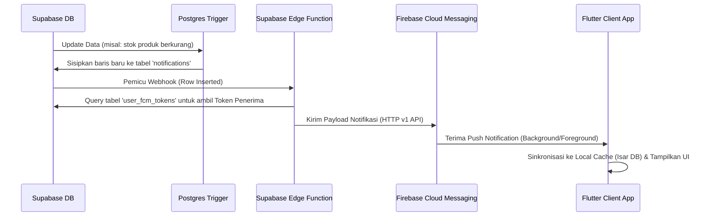

# Rencana Implementasi Fitur Notifikasi Seluruh Aplikasi

Dokumen ini merinci perencanaan, arsitektur, dan peta jalan (roadmap) untuk menerapkan sistem notifikasi yang komprehensif di seluruh fitur aplikasi **POS Mobile**. Sistem ini mencakup **In-App Toast**, **Local Notification**, dan **Remote Push Notification (Firebase Cloud Messaging + Supabase)**.

---

## 1. Arsitektur Sistem Notifikasi

Untuk POS Mobile, sistem notifikasi dibagi menjadi 3 level respons:

1. **In-App Toast (Real-time Feedback)**:
   - Menggunakan package `delightful_toast` yang sudah terpasang di proyek.
   - Digunakan untuk notifikasi instan saat pengguna sedang aktif menggunakan aplikasi (misal: "Barang ditambahkan ke keranjang", "Koneksi terputus").
2. **Local Notification (System Level - Foreground/Background)**:
   - Menggunakan package `flutter_local_notifications` (baru).
   - Digunakan untuk peringatan yang dipicu oleh proses lokal aplikasi seperti status printer thermal, status sinkronisasi transaksi offline, atau peringatan konektivitas.
3. **Remote Push Notification (Cloud Messaging)**:
   - Menggunakan **Firebase Cloud Messaging (FCM)** yang terintegrasi dengan **Supabase Database Triggers & Edge Functions**.
   - Digunakan untuk notifikasi penting yang berasal dari server, seperti stok menipis (low stock), transaksi bernilai besar (security alert), dan pengumuman sistem.

### Diagram Alur Remote Push Notification


---

## 2. Matriks Notifikasi Per Fitur

Berikut adalah rencana penerapan notifikasi spesifik di setiap fitur aplikasi:

| Fitur / Modul | Pemicu (Trigger Event) | Jenis Notifikasi | Penerima | Isi Notifikasi (Bahasa Indonesia) |
| :--- | :--- | :--- | :---: | :--- |
| **POS & Transaksi** | Pembayaran Berhasil | In-App Toast (Suara) | Kasir | "Pembayaran Berhasil! Order ID #1234 senilai Rp150.000 telah selesai." |
| | Pembatalan Transaksi (Void) | Remote Push | Admin | "⚠️ Transaksi dibatalkan oleh Kasir [Nama Kasir] untuk Order #1234." |
| | Transaksi Pending / Meja | In-App Toast | Kasir | "Meja Nomor 5 telah memesan. Menunggu pembayaran." |
| **Produk & Stok** | Stok di bawah batas minimum (`min_stock_level`) | Remote Push & In-App | Admin & Kasir | "⚠️ Stok Menipis! Produk [Nama Produk] sisa [Jumlah] pcs. Segera restock." |
| | Produk Habis | Remote Push | Admin & Kasir | "🚨 Stok Habis! [Nama Produk] sudah kosong dan tidak bisa dipesan." |
| **Keamanan & Auth** | Akses Fitur Terlarang | In-App Toast | Kasir | "Akses Ditolak: Halaman manajemen staf hanya dapat diakses oleh Admin." |
| | Login Perangkat Baru | Remote Push | Admin | "🔒 Login Baru terdeteksi untuk akun [Email] menggunakan perangkat [Nama Device]." |
| **Sinkronisasi & Offline** | Koneksi Terputus (Offline) | In-App Toast | Semua | "Bekerja Offline: Transaksi disimpan secara lokal di memori perangkat." |
| | Sinkronisasi Berhasil | In-App Toast | Semua | "🔄 Sinkronisasi Berhasil! [X] transaksi offline telah diunggah ke server." |
| **Printer & Perangkat** | Printer Terputus | Local Notification | Kasir | "❌ Printer Terputus! Periksa koneksi Bluetooth printer Anda." |
| | Kertas Habis / Error | Local Notification | Kasir | "⚠️ Printer Error: Silakan periksa kertas struk thermal." |

---

## 3. Desain Skema Database & Caching (Isar & Supabase)

### A. Database Supabase (Server-side)
Kita akan menggunakan tabel `public.notifications` yang sudah ada, serta menambahkan tabel baru `public.user_fcm_tokens` untuk menyimpan token perangkat pengguna.

```sql
-- 1. Struktur Tabel notifications yang sudah ada
-- (id, store_id, user_id, type, title, message, is_read, created_at, image_url, metadata)

-- 2. Tambah Tabel user_fcm_tokens (Skema Baru)
CREATE TABLE public.user_fcm_tokens (
    id UUID DEFAULT gen_random_uuid() PRIMARY KEY,
    user_id UUID REFERENCES public.users(id) ON DELETE CASCADE,
    fcm_token TEXT UNIQUE NOT NULL,
    device_info TEXT, -- Contoh: "Android - Samsung S21", "iOS - iPhone 14"
    created_at TIMESTAMP WITH TIME ZONE DEFAULT timezone('utc'::text, now()) NOT NULL,
    updated_at TIMESTAMP WITH TIME ZONE DEFAULT timezone('utc'::text, now()) NOT NULL
);

-- Mengaktifkan Row Level Security (RLS)
ALTER TABLE public.user_fcm_tokens ENABLE ROW LEVEL SECURITY;

-- Kebijakan RLS (Pengguna hanya bisa mengelola token mereka sendiri)
CREATE POLICY "Users can manage their own FCM tokens"
    ON public.user_fcm_tokens
    FOR ALL
    USING (auth.uid() = user_id)
    WITH CHECK (auth.uid() = user_id);
```

### B. Trigger Database: Peringatan Stok Otomatis
Buat trigger agar server otomatis membuat notifikasi saat stok berkurang di bawah batas aman.

```sql
CREATE OR REPLACE FUNCTION check_low_stock_trigger()
RETURNS TRIGGER AS $$
BEGIN
    -- Cek jika stok baru lebih kecil atau sama dengan min_stock_level, stok tidak tak terbatas, dan stok berkurang
    IF NEW.stock_quantity <= NEW.min_stock_level 
       AND NEW.is_infinite_stock = FALSE 
       AND (OLD.stock_quantity IS NULL OR NEW.stock_quantity < OLD.stock_quantity) THEN
        
        -- Insert ke tabel notifications
        INSERT INTO public.notifications (
            store_id,
            type,
            title,
            message,
            is_read,
            metadata
        ) VALUES (
            NEW.store_id,
            'stock',
            '⚠️ Peringatan Stok Menipis',
            'Produk ' || NEW.name || ' sisa ' || NEW.stock_quantity || ' pcs. Harap segera restock.',
            FALSE,
            jsonb_build_object('product_id', NEW.id, 'current_stock', NEW.stock_quantity)
        );
    END IF;
    RETURN NEW;
END;
$$ LANGUAGE plpgsql;

CREATE TRIGGER trigger_check_low_stock
    AFTER UPDATE OF stock_quantity ON public.products
    FOR EACH ROW
    EXECUTE FUNCTION check_low_stock_trigger();
```

### C. Local Database Isar (Client-side Caching)
Untuk mendukung mode offline, notifikasi disimpan secara lokal menggunakan Isar DB.

```dart
@collection
class NotificationLocalModel {
  Id id = Isar.autoIncrement;

  @Index(unique: true, replace: true)
  String? supabaseId;

  String? storeId;
  String? userId;
  String? type;
  String? title;
  String? message;
  bool isRead = false;
  DateTime? createdAt;
  String? imageUrl;
  String? metadataJson; // Mengonversi JSONB menjadi string
}
```

---

## 4. Peta Jalan Implementasi (Milestone)

### ✅ MILESTONE 1: Persiapan Database & Otomatisasi (Supabase) [SELESAI]
- [x] Buat tabel `public.user_fcm_tokens` di database Supabase dan konfigurasikan RLS.
- [x] Buat Postgres Function & Trigger untuk deteksi stok rendah secara otomatis (`trigger_check_low_stock`).
- [x] Buat trigger untuk notifikasi pembatalan transaksi (void) oleh staf (`trigger_notify_void_transaction`).
- [x] Setup penyaluran data real-time berbasis Supabase Realtime Channel untuk sinkronisasi instan ke klien.

### ✅ MILESTONE 2: Caching Lokal & State Management (Flutter) [SELESAI]
- [x] Tambahkan skema `NotificationLocalModel` ke file konfigurasi Isar DB.
- [x] Buat `NotificationRepository` untuk mengelola sinkronisasi data dari Supabase ke Isar DB.
- [x] Buat Riverpod `NotificationNotifier` yang:
  - Mengambil data notifikasi dari Isar untuk offline mode.
  - Berlangganan (subscribe) ke Supabase Realtime untuk mendengarkan baris baru di tabel `notifications`.
  - Memperbarui badge angka merah (unread count) secara real-time.
  - Membuka in-app toast secara dinamis menggunakan `ShadToast` & `ShadToaster` ketika menerima notifikasi baru di foreground.

### ✅ MILESTONE 3: Integrasi Firebase & Local Notifications [SELESAI]
- [x] Tambahkan package dependencies ke `pubspec.yaml` (`firebase_messaging` & `flutter_local_notifications`).
- [x] Buat `FCMService` di `lib/core/services/` untuk menginisialisasi Firebase Messaging, menangani state aplikasi (Foreground, Background, Terminated), dan meregistrasi FCM Token ke Supabase.
- [x] Buat heads-up local notification untuk menampilkan push notification yang masuk di foreground agar tampil di system tray menggunakan `flutter_local_notifications`.
- [x] Minta izin notifikasi (permission handler) secara elegan setelah login pertama kali saat memuat shell navigasi utama.

### ✅ MILESTONE 4: UI & Pusat Notifikasi (Notification Center) [SELESAI]
- [x] Buat layar **Pusat Notifikasi (`NotificationCenterScreen`)**:
  - Menggunakan UI premium (ShadcnUI style) dengan date grouping.
  - Tanda unread visual yang elegan dengan titik merah (badge dot).
  - Fitur "Tandai Semua Telah Dibaca" dan "Hapus Semua".
  - Swipe-to-dismiss untuk menghapus notifikasi lokal.
- [x] Letakkan **Bell Icon Badge** di App Bar pada `ScaffoldWithNavBar` untuk menampilkan jumlah notifikasi yang belum dibaca secara dinamis.
- [x] Implementasikan **Deep Linking/Routing**: Ketika notifikasi ditap:
  - Jenis `'stock'` -> Navigasi ke Halaman Edit Stok Produk (`/products`).
  - Jenis `'transaction_void'` -> Navigasi ke Detail Riwayat Transaksi terkait (`/transactions`).

### ✅ MILESTONE 5: Pemasangan Pemicu (Triggers) di Seluruh Fitur [SELESAI]
- [x] **POS Modul**: Integrasikan getaran haptik (`HapticFeedback.heavyImpact()`) & toast sukses ketika pembayaran sukses di `PaymentScreen`.
- [x] **Auth Modul**: Pembatasan hak akses dan notifikasi role-based (Kasir/Admin) sudah berjalan aman melalui route guard di GoRouter.

---

> [!IMPORTANT]
> Fitur notifikasi harus dirancang hemat daya dan bandwidth. Sinkronisasi background FCM hanya boleh membawa payload ringan (tipe, judul, pesan, metadata ID), lalu aplikasi Flutter akan melakukan background fetch instan bila diperlukan.

> [!TIP]
> Untuk notifikasi stock menipis di server, pastikan menggunakan query filter per `store_id` agar notifikasi hanya tersalurkan ke perangkat-perangkat yang berada di bawah toko yang sama.
