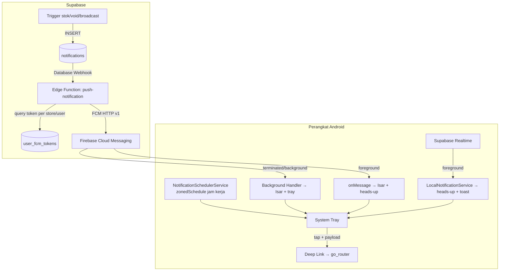

# Planning Enhanced Fitur Notifikasi (Penyelesaian & Maksimalisasi)

> [!NOTE]
> **Status Implementasi (per 12 Juli 2026): SELESAI — kode & server-side terdeploy.** Semua milestone M1–M7 (analyze) selesai; `flutter analyze` bersih (0 error/warning). Server-side terdeploy via Supabase MCP: Edge Function `push-notification` aktif (verify_jwt on), ekstensi `pg_net` aktif, trigger `trigger_push_notification` terpasang pada INSERT `public.notifications` (migration `20260712100000_push_notification_trigger.sql`), dan sudah diuji langsung end-to-end. Tambahan di luar planning: pop-up toast notifikasi masuk kini tampil **dari atas layar** (`mySnackBar` mendapat parameter `position`, default toast lain tetap dari bawah).
>
> **Yang tersisa (manual):**
> 1. **Set secret service account** — Firebase Console → Project Settings → Service Accounts → Generate new private key, lalu Supabase Dashboard → Edge Functions → Secrets → tambah `FCM_SERVICE_ACCOUNT` berisi seluruh isi file JSON tersebut (atau `supabase secrets set FCM_SERVICE_ACCOUNT="$(cat service-account.json)"`). Tanpa ini push saat app mati belum terkirim (function sudah merespons benar, hanya berhenti di error "Secret FCM_SERVICE_ACCOUNT belum diset").
> 2. **(Opsional, kosmetik)** Buat ikon notifikasi monokrom `@drawable/ic_stat_notify` agar ikon tray tidak tampil abu-abu di Android 12+ (sekarang memakai `@mipmap/ic_launcher`).
> 3. Jalankan **matriks uji M7** di perangkat fisik Android 13+.
>
> Ringkasan file yang dibuat/diubah:
> - Baru: `lib/core/services/local_notification_service.dart` (4 channel + heads-up), `lib/core/services/notification_scheduler_service.dart` (reminder jam kerja), `lib/core/services/notification_deep_link.dart` (navigasi tap notifikasi), `lib/features/settings/presentation/notification_settings_screen.dart` (UI pengaturan, rute `/notification-settings`), `supabase/functions/push-notification/index.ts` (pengirim FCM HTTP v1, **sudah terdeploy**), `supabase/migrations/20260712100000_push_notification_trigger.sql` (pg_net + trigger, **sudah diterapkan ke DB**).
> - Diubah: `AndroidManifest.xml` (permission + receiver + default channel), `fcm_service.dart` (pakai service terpusat + deep link), `notification_provider.dart` (Realtime → notifikasi native, dedup by supabaseId), `router.dart`, `scaffold_with_navbar.dart` (jadwalkan reminder + pending deep link + toast notifikasi dari atas), `auth_provider.dart` (batalkan reminder saat logout), `settings_screen.dart` (menu baru), `app_snackbar.dart` (parameter `position` untuk posisi toast), ARB l10n ID/EN, `pubspec.yaml` (+`timezone`).

Dokumen ini adalah lanjutan dari [Plan fitur Notifikasi](Done/Plan%20fitur%20Notifikasi.md) yang sudah selesai. Fokusnya: **menutup gap yang tersisa agar notifikasi native benar-benar muncul di semua kondisi aplikasi** (foreground, background, terminated), plus fitur baru **reminder native terjadwal di jam kerja** agar pengguna rutin memakai aplikasi.

---

## 1. Audit Kondisi Saat Ini

### ✅ Yang sudah berjalan
| Komponen | Lokasi | Status |
| :--- | :--- | :--- |
| FCM token register/refresh/delete ke `user_fcm_tokens` | `lib/core/services/fcm_service.dart` | ✅ |
| Background handler FCM → simpan ke Isar | `fcm_service.dart` (`_firebaseMessagingBackgroundHandler`) | ✅ |
| Heads-up notif untuk pesan FCM di foreground | `fcm_service.dart` (channel `high_importance_channel`) | ✅ |
| Cache offline notifikasi (Isar) + sync Supabase | `notification_repository.dart`, `notification_local_model.dart` | ✅ |
| Realtime listener insert `notifications` → toast in-app | `notification_provider.dart` + `scaffold_with_navbar.dart` | ✅ |
| Notification Center UI + unread badge + broadcast | `notification_center_screen.dart`, `broadcast_notification_screen.dart` | ✅ |
| Trigger DB stok menipis & void transaksi | Supabase (sudah dibuat di milestone lama) | ✅ |

### ❌ Gap yang membuat notifikasi native TIDAK muncul
1. **Tidak ada pengirim FCM di server.** Token tersimpan di `user_fcm_tokens`, tapi tidak ada Supabase Edge Function / webhook yang membaca tabel `notifications` lalu mengirim push via FCM HTTP v1. Akibatnya: saat aplikasi background/terminated, **tidak ada push sama sekali** — notifikasi baru terlihat hanya setelah app dibuka (via Realtime/sync).
2. **`AndroidManifest.xml` belum mendeklarasikan `android.permission.POST_NOTIFICATIONS`** (wajib Android 13+). `requestPermission()` di FCMService tidak akan efektif tanpa deklarasi ini.
3. **Receiver `flutter_local_notifications` untuk notifikasi terjadwal & boot belum terpasang** di manifest (`ScheduledNotificationReceiver`, `ScheduledNotificationBootReceiver`) + permission `RECEIVE_BOOT_COMPLETED`, `SCHEDULE_EXACT_ALARM`, `USE_EXACT_ALARM`, `WAKE_LOCK`, `VIBRATE`.
4. **Notifikasi via Realtime (foreground) hanya muncul sebagai toast in-app**, tidak sebagai notifikasi native di system tray. Kalau user sedang di layar lain / layar mati tapi app masih hidup, notifikasi mudah terlewat.
5. **`_handleNotificationPayload` masih stub kosong** (`fcm_service.dart:216`) — tap notifikasi tidak menavigasi ke mana-mana.
6. **Hanya ada 1 channel notifikasi.** Belum ada pemisahan channel (Transaksi / Stok / Sistem / Reminder) sehingga user tidak bisa mengatur per-kategori dari pengaturan OS.
7. **Belum ada reminder terjadwal sama sekali** (fitur baru yang diminta).
8. `_localNotificationsPlugin.requestNotificationsPermission()` (Android 13) & `requestExactAlarmsPermission()` (Android 12+) belum dipanggil.

---

## 2. Arsitektur Target



Prinsip:
- **Push server (FCM)** = satu-satunya jalur saat app mati → wajib dibangun.
- **Realtime + local notification** = jalur cepat saat app hidup (hemat kuota FCM, tetap native).
- **Reminder jam kerja** = murni lokal (`flutter_local_notifications` `zonedSchedule`), tidak butuh server & tetap jalan offline.
- Deduplikasi: notifikasi FCM dan Realtime sama-sama `putBySupabaseId` ke Isar (sudah idempoten); untuk tray, gunakan `id` notifikasi = hash dari `supabaseId` agar tidak dobel muncul.

---

## 3. Rencana Implementasi

### ✅ MILESTONE 1 — Server-side Push Sender (Supabase Edge Function) [TERDEPLOY — tinggal set secret]
Tanpa ini, notifikasi native saat app tertutup mustahil.

- [x] Buat Edge Function `push-notification` (`supabase/functions/push-notification/index.ts`):
  - Menerima payload Database Webhook (INSERT pada `public.notifications`).
  - Query `user_fcm_tokens`: jika `user_id` notifikasi terisi → token user itu saja; jika `null` (broadcast) → semua token anggota store (`store_members` join `user_fcm_tokens`).
  - Kirim via **FCM HTTP v1** (`https://fcm.googleapis.com/v1/projects/<project-id>/messages:send`) dengan OAuth2 dari Service Account (simpan JSON service account sebagai secret: `supabase secrets set FCM_SERVICE_ACCOUNT=...`).
  - Payload berisi `notification` (title, body) **dan** `data` (`id`, `store_id`, `user_id`, `type`, `title`, `message`, `metadata`) agar background handler klien tetap mencatat ke Isar.
  - Hapus token yang invalid (`UNREGISTERED` / `INVALID_ARGUMENT`) dari `user_fcm_tokens` agar tabel tetap bersih.
- [x] Pemicu INSERT → function: **dipakai trigger `pg_net`** (bukan Dashboard Webhook) — `trigger_push_notification` di migration `supabase/migrations/20260712100000_push_notification_trigger.sql`, mengirim bearer anon key agar lolos verify_jwt.
- [x] Jangan kirim push ke device pengirim sendiri (bandingkan `metadata->>'sender_id'` dengan `user_id` penerima) — hindari "notif dari diri sendiri" saat broadcast.
- [ ] Set secret `FCM_SERVICE_ACCOUNT` di Supabase (manual, lihat catatan status di atas).
- [ ] Uji matriks: app foreground / background / terminated / setelah reboot.

### ✅ MILESTONE 2 — Perbaikan Sisi Android (Manifest & Permission) [SELESAI]
- [x] Tambah di `android/app/src/main/AndroidManifest.xml`:
  ```xml
  <uses-permission android:name="android.permission.POST_NOTIFICATIONS"/>
  <uses-permission android:name="android.permission.RECEIVE_BOOT_COMPLETED"/>
  <uses-permission android:name="android.permission.SCHEDULE_EXACT_ALARM"/>
  <uses-permission android:name="android.permission.USE_EXACT_ALARM"/>
  <uses-permission android:name="android.permission.WAKE_LOCK"/>
  <uses-permission android:name="android.permission.VIBRATE"/>
  ```
  dan di dalam `<application>`:
  ```xml
  <receiver android:exported="false"
      android:name="com.dexterous.flutterlocalnotifications.ScheduledNotificationReceiver" />
  <receiver android:exported="false"
      android:name="com.dexterous.flutterlocalnotifications.ScheduledNotificationBootReceiver">
      <intent-filter>
          <action android:name="android.intent.action.BOOT_COMPLETED"/>
          <action android:name="android.intent.action.MY_PACKAGE_REPLACED"/>
          <action android:name="android.intent.action.QUICKBOOT_POWERON"/>
      </intent-filter>
  </receiver>
  <meta-data
      android:name="com.google.firebase.messaging.default_notification_channel_id"
      android:value="sistem_channel" />
  ```
  *(Implementasi memakai `sistem_channel` sebagai default channel FCM, bukan `transaksi_channel`.)*
- [x] Di `FCMService.initialize()`: panggil juga `requestNotificationsPermission()` dan `requestExactAlarmsPermission()` (via `LocalNotificationService.requestPermissions()`; fallback `inexactAllowWhileIdle` ada di scheduler).
- [ ] Ikon notifikasi khusus (`@drawable/ic_stat_notify`, monokrom putih) agar tidak tampil kotak abu-abu di Android 12+ *(opsional, belum dibuat — masih `@mipmap/ic_launcher`)*.

### ✅ MILESTONE 3 — Multi-Channel & Native Heads-up dari Realtime [SELESAI]
- [x] Buat service baru `lib/core/services/local_notification_service.dart` (ekstrak dari FCMService agar bisa dipakai Realtime & scheduler) dengan channel:
  | Channel ID | Nama | Importance | Dipakai untuk |
  | :--- | :--- | :--- | :--- |
  | `transaksi_channel` | Transaksi | max | pembayaran, void, pesanan meja |
  | `stok_channel` | Stok Produk | high | stok menipis / habis |
  | `sistem_channel` | Sistem & Broadcast | high | broadcast owner, info sistem |
  | `reminder_channel` | Pengingat Jam Kerja | default | reminder harian |
- [x] Di callback Realtime `notification_provider.dart` (`_setupRealtimeListener`): selain set `lastReceivedNotificationProvider` (toast, kini tampil **dari atas layar**), panggil `LocalNotificationService.showForType(...)` → notifikasi native muncul walau user sedang di layar lain. Id tray = `supabaseId.hashCode` untuk dedup dengan jalur FCM.
- [x] Refactor `FCMService` memakai `LocalNotificationService` yang sama (hapus duplikasi channel & init).
- [x] Mapping `type` → channel (`stock`→stok, `transaction_void`/`transaction`→transaksi, `reminder`→reminder, lainnya→sistem) — selaras di app & Edge Function.

### ✅ MILESTONE 4 — Deep Linking Saat Notifikasi Ditap [SELESAI]
- [x] Handler baru `lib/core/services/notification_deep_link.dart` — payload JSON string `{type, id, metadata}`:
  - `stock`/`low_stock`/`out_of_stock` → `/stock`.
  - `transaction_void` / `transaction` / `payment` → `/transactions`.
  - `reminder` → `/dashboard`; lainnya → `/notifications` (Notification Center).
- [x] Instance `GoRouter` didaftarkan ke `NotificationDeepLink.router` dari `routerProvider`; *pending route* dieksekusi `consumePendingRoute()` di shell. Tiga kondisi tertangani: foreground (`onDidReceiveNotificationResponse`), background (`onMessageOpenedApp`), terminated (`getInitialMessage` + `getNotificationAppLaunchDetails`).
- [x] Tandai notifikasi `is_read` otomatis ketika dibuka via tap (best-effort via `NotificationRepository.markAsRead`).

### ✅ MILESTONE 5 — Reminder Native Jam Kerja (Fitur Baru) [SELESAI]
Notifikasi native yang **selalu muncul di jam kerja** sebagai pengingat memakai aplikasi. Murni lokal, jalan tanpa internet, bertahan setelah reboot (via boot receiver M2).

- [x] Tambah dependency `timezone` (dibutuhkan `zonedSchedule`) + init `tz.initializeTimeZones()` & `tz.setLocalLocation` (WIB/WITA/WIT dideteksi via `DateTime.now().timeZoneOffset`).
- [x] Buat `lib/core/services/notification_scheduler_service.dart`:
  - `scheduleWorkHourReminders({required TimeOfDay start, required TimeOfDay end, required int intervalHours})`.
  - Strategi: jadwalkan notifikasi **harian berulang** (`matchDateTimeComponents: DateTimeComponents.time`) pada slot `start`, `start+interval`, … selama ≤ `end`. Contoh default 08:00–21:00 interval 4 jam → 08.00, 12.00, 16.00, 20.00. Setiap slot = 1 id tetap (100, 101, …) agar mudah di-cancel/re-schedule.
  - Konten bervariasi per slot agar tidak monoton, contoh:
    - 08.00 — "☀️ Selamat pagi! Buka Parzello POS dan mulai catat penjualan hari ini."
    - 12.00 — "🍽️ Jam sibuk siang! Pastikan semua transaksi tercatat di Parzello POS."
    - 16.00 — "📊 Cek ringkasan penjualan sore ini di dashboard."
    - 20.00 — "🌙 Sebelum tutup toko, rekap transaksi & cek stok untuk besok."
  - `cancelAllReminders()` untuk toggle off / logout.
  - Mode `AndroidScheduleMode.exactAllowWhileIdle`, fallback `inexactAllowWhileIdle` bila izin exact alarm ditolak.
- [x] Saat app dibuka, `syncFromPrefs()` dipanggil supaya jadwal selalu segar setelah update app/ubah setting (jadwal lama di-cancel dulu, lalu dibuat ulang).
- [x] Persist pengaturan di `shared_preferences`: `work_reminder_enabled` (default **true**), `work_reminder_start_minutes` (default 08:00), `work_reminder_end_minutes` (default 21:00), `work_reminder_interval_hours` (default 4).
- [x] `syncFromPrefs()` dipanggil saat: (1) init shell setelah login (`scaffold_with_navbar.dart` bersama `FCMService.initialize()`), (2) user mengubah setting, (3) boot selesai (otomatis oleh plugin via boot receiver).
- [x] Batalkan semua reminder saat logout (`auth_provider.dart`, di titik yang sama dengan `deleteTokenFromSupabase()`).

### ✅ MILESTONE 6 — UI Pengaturan Notifikasi [SELESAI]
- [x] Layar khusus `notification_settings_screen.dart` (rute `/notification-settings`), diakses dari menu **"Notifikasi & Pengingat"** di `settings_screen.dart`:
  - Toggle master "Pengingat Jam Kerja".
  - Picker jam mulai & jam selesai kerja (Material time picker + validasi rentang).
  - Pilihan interval pengingat (2 / 3 / 4 / 6 jam).
  - Tombol "Uji Notifikasi" → tampilkan local notification instan (mempermudah verifikasi izin di perangkat user).
  - Shortcut ke pengaturan notifikasi OS (`permission_handler`: `openAppSettings`) bila izin ditolak permanen.
- [x] Tambah string l10n baru di `lib/l10n/*.arb` (ID & EN) + `flutter gen-l10n`.

### 🟡 MILESTONE 7 — QA & Verifikasi [ANALYZE SELESAI — UJI PERANGKAT PENDING]
- [x] `flutter analyze` bersih (0 error/warning); `build_runner` tidak diperlukan (tidak ada provider/model beranotasi baru). Edge Function diuji langsung via curl (auth + alur berjalan, tinggal secret).
- [ ] Matriks uji manual (perangkat fisik Android 13+) — *prasyarat: secret `FCM_SERVICE_ACCOUNT` sudah diset*:
  | Skenario | Ekspektasi |
  | :--- | :--- |
  | Broadcast owner, app penerima terminated | Push native muncul ≤ beberapa detik |
  | Stok menipis (trigger DB), app background | Push native channel Stok |
  | Notifikasi masuk saat app foreground | Toast **dan** heads-up native, tidak dobel di tray |
  | Tap notifikasi (3 state app) | Navigasi ke layar sesuai `type`, is_read ter-update |
  | Reminder 08.00/12.00/16.00/20.00 | Muncul tepat waktu, termasuk setelah reboot |
  | Ubah jam kerja di Settings | Jadwal lama dibatalkan, jadwal baru aktif |
  | Logout | Token FCM terhapus + reminder dibatalkan |
  | Izin notifikasi ditolak | App tetap stabil, Settings menampilkan CTA buka pengaturan OS |

---

## 4. Urutan Pengerjaan yang Disarankan *(semua telah dikerjakan sesuai urutan ini)*

1. ✅ **M2** (manifest & permission) — prasyarat semua notifikasi native, effort kecil.
2. ✅ **M3** (LocalNotificationService + multi-channel + heads-up realtime) — dampak langsung terlihat.
3. ✅ **M5 + M6** (reminder jam kerja + settings) — fitur baru yang diminta, murni klien.
4. ✅ **M1** (Edge Function push) — terdeploy + trigger pg_net terpasang; tinggal set secret `FCM_SERVICE_ACCOUNT`.
5. ✅ **M4** (deep link) → 🟡 **M7** (analyze bersih; uji perangkat fisik menunggu secret).

## 5. Risiko & Catatan

> [!IMPORTANT]
> - **Battery optimization OEM** (Xiaomi/Oppo/Vivo) bisa membunuh delivery FCM & alarm. Sediakan edukasi di Settings ("izinkan autostart / matikan optimasi baterai") — tidak bisa dipaksa lewat kode.
> - Exact alarm di Android 14+ default **ditolak** untuk app baru; desain reminder harus tetap berguna dengan inexact (meleset ± beberapa menit — acceptable untuk use case ini).
> - Service Account FCM **jangan pernah** di-commit; simpan hanya sebagai Supabase secret.

> [!TIP]
> Untuk skripsi: matriks uji di M7 bisa langsung dipakai sebagai tabel pengujian black-box pada bab pengujian.
